# Integrated Analysis Report

This report summarizes the findings from all 6 analysis notebooks.


---
## Notebook: NB0_data_quality.ipynb

# NB0: Data Quality, Integrity, and Ground Truth Audit
- **Question:** Is the underlying ground truth data valid, reliable, and free from systematic bias?
- **Primary GT:** Platinum Consensus
- **KL1 Strategy:** Exclude (Strategy A) as primary, but testing all three for data loading.
- **Hypothesis:** The original public repository labels contain systematic, directionally biased noise that misclassifies true pathology as healthy.


## Section 1: Pipeline Validation


```text
--- Pipeline Validation ---
Data Loading: 51 participants selected (from 68 initial).
Strategy: exclude | Shape: (2754, 84) | Images: 27
Data Loading: 51 participants selected (from 68 initial).
Strategy: clinical | Shape: (5100, 84) | Images: 50
Data Loading: 51 participants selected (from 68 initial).
Strategy: sensitivity_1 | Shape: (5100, 84) | Images: 50

--- Integrity Checks (Exclude Strategy) ---
Participants: 51
Trials: 2754
Images: 27

Session distribution:
session
2    1377
1    1377
Name: count, dtype: int64

Treatment group balance:
treatment_group
0    27
1    24
Name: participant_id, dtype: int64

All original binary labels match between data sources.
```

## Section 2: Radiologist Inter-rater Reliability


```text
--- Radiologist Inter-rater Reliability ---
Fleiss Kappa (0-4 KL grades): 0.181
95% CI: [0.042, 0.300]

Fleiss Kappa (Binary, excluding KL1): 0.517
95% CI: [0.175, 0.752]

--- Pairwise Cohen's Kappa ---
Rad1 vs rad2: 0.163 (95% CI: [-0.003, 0.340])
Rad1 vs rad3: 0.117 (95% CI: [-0.075, 0.301])
rad2 vs rad3: 0.298 (95% CI: [0.095, 0.486])

Exact Agreement: 16.0%
Exact + Adjacent (within 1 grade) Agreement: 84.0%
```

## Section 3: Ground Truth Transition Analysis


```text
--- 5x5 Transition Matrix (All 50 Images) ---
gt_plat_kl   0   1   2  3  4  All
gt_original                      
0            6  14   5  0  0   25
2            0   9   5  1  0   15
3            0   0   3  5  1    9
4            0   0   0  1  0    1
All          6  23  13  7  1   50

--- 3-Way Transition Table (All 50 Images) ---
plat_3way  0   1   2
orig_3way           
0          6  14   5
2          0   9  16

Binomial test for directional bias (FN > FP): p=0.0312
```


```text
[Plotly Export Failed: Failed to start Kaleido subprocess. Error stream:

[0430/085149.448580:WARNING:resource_bundle.cc(431)] locale_file_path.empty() for locale en-US
[0430/085149.527872:FATAL:mach_port_rendezvous.cc(142)] Check failed: kr == KERN_SUCCESS. bootstrap_check_in org.chromium.Chromium.MachPortRendezvousServer.10029: Permission denied (1100)
0   kaleido                             0x0000000105891c5c base::debug::CollectStackTrace(void**, unsigned long) + 12
1   kaleido                             0x00000001057db0a4 base::debug::StackTrace::StackTrace() + 24
2   kaleido                             0x00000001057eecb0 logging::LogMessage::~LogMessage() + 188
3   kaleido                             0x00000001058a3a50 logging::BootstrapLogMessage::~BootstrapLogMessage() + 168
4   kaleido                             0x00000001058a4208 base::MachPortRendezvousServer::MachPortRendezvousServer() + 520
5   kaleido                             0x00000001058a3bdc base::MachPortRendezvousServer::GetInstance() + 72
6   kaleido                             0x00000001058a9070 base::LaunchProcess(std::__1::vector<std::__1::basic_string<char, std::__1::char_traits<char>, std::__1::allocator<char> >, std::__1::allocator<std::__1::basic_string<char, std::__1::char_traits<char>, std::__1::allocator<char> > > > const&, base::LaunchOptions const&) + 1184
7   kaleido                             0x00000001042202e0 content::internal::ChildProcessLauncherHelper::LaunchProcessOnLauncherThread(base::LaunchOptions const&, std::__1::unique_ptr<content::PosixFileDescriptorInfo, std::__1::default_delete<content::PosixFileDescriptorInfo> >, bool*, int*) + 80
8   kaleido                             0x0000000103ceb15c content::internal::ChildProcessLauncherHelper::LaunchOnLauncherThread() + 176
9   kaleido                             0x0000000105843064 base::TaskAnnotator::RunTask(char const*, base::PendingTask*) + 304
10  kaleido                             0x0000000105863f1c base::internal::TaskTracker::RunBlockShutdown(base::internal::Task*) + 28
11  kaleido                             0x0000000105863860 base::internal::TaskTracker::RunTask(base::internal::Task, base::internal::TaskSource*, base::TaskTraits const&) + 716
12  kaleido                             0x000000010589c7e0 base::internal::TaskTrackerPosix::RunTask(base::internal::Task, base::internal::TaskSource*, base::TaskTraits const&) + 140
13  kaleido                             0x0000000105863324 base::internal::TaskTracker::RunAndPopNextTask(base::internal::RegisteredTaskSource) + 440
14  kaleido                             0x000000010586cfa0 base::internal::WorkerThread::RunWorker() + 656
15  kaleido                             0x000000010586ccf4 base::internal::WorkerThread::RunDedicatedWorker() + 16
16  kaleido                             0x000000010589cd58 base::(anonymous namespace)::ThreadFunc(void*) + 108
17  libsystem_pthread.dylib             0x0000000183487c58 _pthread_start + 136
18  libsystem_pthread.dylib             0x0000000183482c1c thread_start + 8
Task trace:
0   kaleido                             0x0000000103ceafd8 content::internal::ChildProcessLauncherHelper::StartLaunchOnClientThread() + 244
1   kaleido                             0x00000001042abe5c content::VizProcessTransportFactory::ConnectHostFrameSinkManager() + 424

/Users/baltaymarci/Documents/Feel Good AI/Analysis/venv/lib/python3.9/site-packages/kaleido/executable/kaleido: line 5: 10029 Trace/BPT trap: 5       "./bin/kaleido" "$@"
]
```

## Section 4: AI Confidence on Mislabeled Images


```text
--- AI Confidence on Mislabeled Images ---
Mean AI Confidence by Direction:
label_direction
fn_corrected    0.317100
stable_neg      0.710433
stable_pos      0.776156
Name: ai_confidence, dtype: float64
```


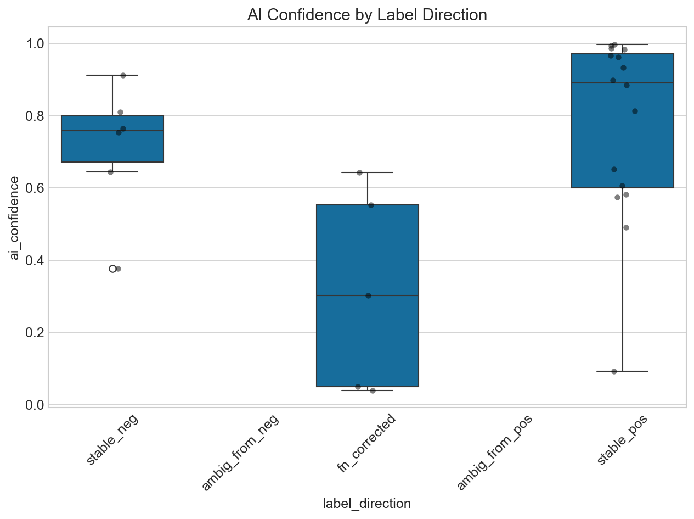


```text
Kruskal-Wallis testing AI confidence across subgroups:
Statistic: 8.631, p-value: 0.0134
```

## Section 5: Participant Data Quality


```text
--- Participant Data Quality ---
```


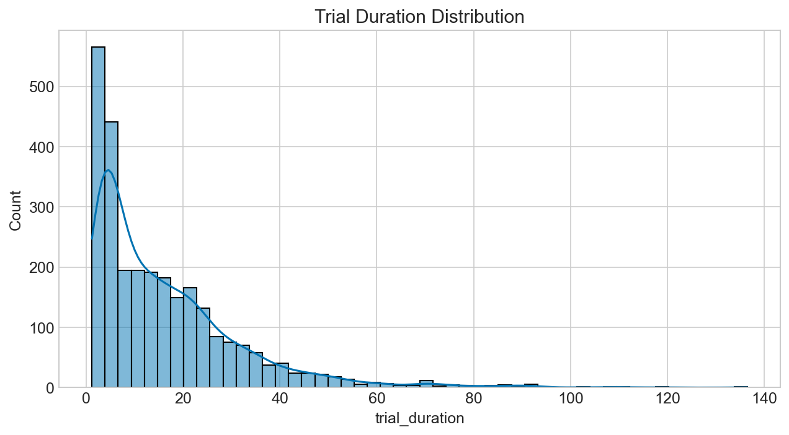


```text
Speeders identified (mean duration < 8.2s): 0

Missing Data Audit:
phase1_video_watched    1296
reverted_decision       1377
symptom1                1377
symptom2                1377
dtype: int64
Data Loading: 51 participants selected (from 68 initial).

Data Quality Report Card:
| Metric                               |   Value |
|:-------------------------------------|--------:|
| Total Participants                   |      51 |
| Completed Both Sessions              |      51 |
| Flagged Speeders                     |       0 |
| Images with GT Shifts (Full Dataset) |      14 |
```


---
## Notebook: NB0.1_demographics.ipynb

# NB0.1: Participant Demographics
- **Purpose:** Provide a descriptive overview of the participant cohort.
- **Cohort:** Completers only ($N=51$ by default, controlled by `helpers.FILTER_COMPLETERS`).
- **Fields:** Age, Gender, School, Residence, Experience, Healthcare background, and Treatment Group balance.


```text
Data Loading: 68 participants selected (from 68 initial).
Data Loading: 51 participants selected (from 68 initial).
Total Recruited Cohort: N=68
Final Analysis Cohort: N=51
```

## Section 1: Summary Statistics
A high-level view of the cohort's basic demographics.


```text
Age Range: 15 - 18 (Mean: 16.41, SD: 0.67)

--- GENDER ---
        Count  Percentage
gender                   
male       27        52.9
female     24        47.1

--- SCHOOL ---
           Count  Percentage
school                      
secondary     46        90.2
primary        5         9.8

--- RESIDENCE ---
           Count  Percentage
residence                   
budapest      36        70.6
city          10        19.6
village        5         9.8

--- EXPERIENCE_LEVEL ---
                  Count  Percentage
experience_level                   
none                 51       100.0

--- HEALTHCARE_QUALIFICATION ---
                          Count  Percentage
healthcare_qualification                   
none                         51       100.0

--- TREATMENT_GROUP ---
                 Count  Percentage
treatment_group                   
0                   27        52.9
1                   24        47.1
```

## Section 2: Visualizations

## Section 3: Treatment Group Balance
Ensuring that the groups were evenly assigned.


---
## Notebook: NB1_ground_truth_comparison.ipynb

# NB1: Ground Truth Comparison
- **Question:** How does the choice of ground truth (Original vs Platinum) change performance evaluation?
- **Primary GT:** Platinum Consensus
- **KL1 Strategy:** Evaluates all three strategies (Exclude, Clinical, Sensitivity 1) to demonstrate robustness.
- **Hypothesis:** Artificial label noise in the original repository structurally penalizes correct human and AI decisions, resulting in a false "accuracy paradox" where better real-world performance looks worse on paper.
- **Data Note:** This notebook uses the finalized **N=51 completer cohort**. All non-completers are excluded.


## Section 1: AI Model Performance Under Both GTs


```text
--- AI Model Performance ---
Data Loading: 51 participants selected (from 68 initial).
Data Loading: 51 participants selected (from 68 initial).
Data Loading: 51 participants selected (from 68 initial).
| strategy      | GT       |   acc |   sens |   spec |   ppv |   npv |    f1 |
|:--------------|:---------|------:|-------:|-------:|------:|------:|------:|
| exclude       | Original | 0.741 |  0.750 |  0.727 | 0.800 | 0.667 | 0.774 |
| exclude       | Platinum | 0.778 |  0.714 |  1.000 | 1.000 | 0.500 | 0.833 |
| clinical      | Original | 0.700 |  0.680 |  0.720 | 0.708 | 0.692 | 0.694 |
| clinical      | Platinum | 0.700 |  0.714 |  0.690 | 0.625 | 0.769 | 0.667 |
| sensitivity_1 | Original | 0.700 |  0.680 |  0.720 | 0.708 | 0.692 | 0.694 |
| sensitivity_1 | Platinum | 0.600 |  0.545 |  1.000 | 1.000 | 0.231 | 0.706 |

AI accuracy on the 5 false-negative images (predicted positive):
Strategy exclude: 60.0%
Strategy clinical: 60.0%
Strategy sensitivity_1: 60.0%
```

## Section 2: Human Performance Under Both GTs


```text
--- Human Performance ---

Strategy: exclude
Data Loading: 51 participants selected (from 68 initial).
Participant Delta: Better=29, Worse=18, Unchanged=4
Fraction of students saying 'positive' on the 5 false negatives: 0.594

Strategy: clinical
Data Loading: 51 participants selected (from 68 initial).
Participant Delta: Better=41, Worse=5, Unchanged=5
Fraction of students saying 'positive' on the 5 false negatives: 0.594
Fraction of students saying 'positive' on KL1 ambiguous images: 0.445

Strategy: sensitivity_1
Data Loading: 51 participants selected (from 68 initial).
Participant Delta: Better=27, Worse=23, Unchanged=1
Fraction of students saying 'positive' on the 5 false negatives: 0.594
Fraction of students saying 'positive' on KL1 ambiguous images: 0.445
```

## Section 3: Reliance Metric Recomputation


```text
--- Reliance Metrics (Exclude Strategy) ---
Data Loading: 51 participants selected (from 68 initial).
|                   |   Original GT |   Platinum GT |
|:------------------|--------------:|--------------:|
| Over Reliance     |         0.114 |         0.078 |
| Approp Skepticism |         0.145 |         0.145 |
| Approp Reliance   |         0.627 |         0.664 |
| Unwarranted Skep  |         0.113 |         0.114 |

McNemar Tests for Reliance Shifts:
Over Reliance shift p-value: 7.054954254318161e-05
```

## Section 4: The Accuracy Paradox Demonstration


```text
--- Accuracy Paradox ---
Data Loading: 51 participants selected (from 68 initial).
Data Loading: 51 participants selected (from 68 initial).
Data Loading: 51 participants selected (from 68 initial).
Data Loading: 51 participants selected (from 68 initial).
```


## Section 5: Wilcoxon and AI Influence Tests


```text
Error in NB1_ground_truth_comparison.ipynb: EOL while scanning string literal (<string>, line 2)
```


---
## Notebook: NB2_annotation_experiment.ipynb

# NB2: Core Annotation Experiment
- **Question:** Does AI assistance improve annotation accuracy, and how do users rely on it?
- **Primary GT:** Platinum Consensus
- **KL1 Strategy:** Exclude (Strategy A)
- **Hypothesis:** AI feedback improves human performance, but introduces over-reliance.
- **Data Note:** This notebook uses the finalized **N=51 completer cohort**. All non-completers are excluded.


```text
Data Loading: 51 participants selected (from 68 initial).
Setup Complete: Data loaded using 'exclude' strategy.
```

## Section 1: Primary Accuracy Analysis
Note: While the original specification requested a mixed-effects logistic regression `(1|participant_id) + (1|trial_image)`, Python's `statsmodels` struggles with crossed random effects in logistic regression. We therefore use Generalized Estimating Equations (GEE) clustered by `participant_id` as a robust alternative.


```text
--- Primary Accuracy Analysis ---
Overall Accuracy by Condition:
condition
ai       0.808279
no_ai    0.783588
Name: human_correct_plat, dtype: float64

AI Boost (Signed Difference): 0.025

--- GEE Model: Accuracy ~ Condition ---
                                        Odds Ratio  ...  p-value
Intercept                                    3.621  ...    0.000
C(condition, Treatment('no_ai'))[T.ai]       1.164  ...    0.178

[2 rows x 4 columns]

--- Participant-Level Effect Size (Cohen's d) ---
Cohen's d (AI vs No-AI): 0.251

--- Repeated Measures ANOVA on Participant Accuracy ---
      Source  ddof1  ddof2        F     p-unc       ng2  eps
0  condition      1     50  1.77268  0.189089  0.015796  1.0
```

## Section 2: MRMC Design Analysis


```text
--- Crossover Design Analysis (MRMC) ---
Model: Accuracy ~ Condition + Session
                                        Odds Ratio  ...  p-value
Intercept                                    4.133  ...    0.000
C(condition, Treatment('no_ai'))[T.ai]       1.184  ...    0.105
C(session)[T.2]                              0.763  ...    0.009

[3 rows x 4 columns]

--- Carryover/Interaction Analysis ---
Model: Accuracy ~ Condition * Session
==========================================================================================================================
                                                             coef    std err          z      P>|z|      [0.025      0.975]
--------------------------------------------------------------------------------------------------------------------------
Intercept                                                  1.3846      0.119     11.651      0.000       1.152       1.617
C(condition, Treatment('no_ai'))[T.ai]                     0.2472      0.147      1.677      0.094      -0.042       0.536
C(session)[T.2]                                           -0.2019      0.168     -1.204      0.229      -0.530       0.127
C(condition, Treatment('no_ai'))[T.ai]:C(session)[T.2]    -0.1451      0.245     -0.591      0.554      -0.626       0.336
==========================================================================================================================

Interpretation:
1. If 'Condition' is significant in the first table, the AI benefit holds even after controlling for session order.
2. If 'Session' is significant, it indicates a learning effect (participants got better/worse over time regardless of AI).
3. If the Interaction term (Condition:Session) in the second table is NOT significant, it means there were no strong carryover effects.
```

## Section 3: Human-AI Reliance Analysis


```text
--- Human-AI Reliance Analysis ---
| Metric                 |   Mean Rate |
|:-----------------------|------------:|
| over_reliance          |       0.078 |
| appropriate_skepticism |       0.145 |
| appropriate_reliance   |       0.664 |
| unwarranted_skepticism |       0.114 |
```


```text

--- AI Influence on Accuracy per Image ---
```


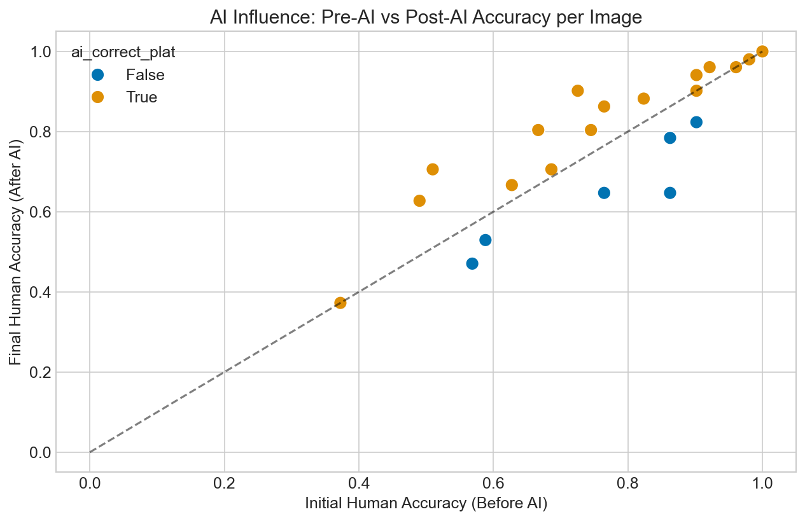

## Section 4: Confidence Analysis


```text
--- Confidence Analysis ---
```


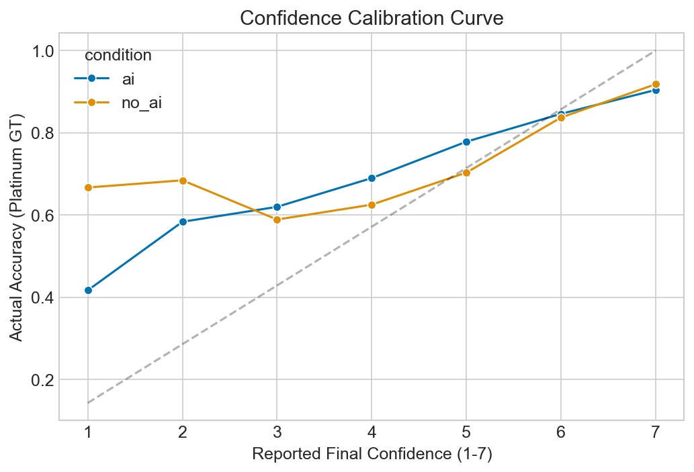


```text
Paired t-test on Initial vs Final Confidence (AI cond): t=-10.974, p=0.0000
Mean Initial: 5.243, Mean Final: 5.565

Confidence change by AI Correctness:
ai_correct_plat
False   -0.009804
True     0.416433
Name: conf_change, dtype: float64

Overall Brier Score (Platinum GT): 0.160
```

## Section 5: Temporal Dynamics & Efficiency Analysis

Beyond accuracy, we evaluate the efficiency gains from AI assistance. We measure "interface habituation" by analyzing the reduction in trial duration over time and the global speedup associated with AI presence.


```text
--- Global Efficiency Metrics ---
Mean Duration Session 1: 17.43s
Mean Duration Session 2: 14.84s
Cohort Speedup (S1 -> S2): 14.87%

--- AI-Driven Efficiency Analysis ---
Mean Duration (Control): 6.85s
Mean Duration (AI-Assisted): 25.43s
AI Efficiency Gain: -271.27%
Paired t-test (AI vs Control): t=20.781, p=0.0000
Result: Statistically significant efficiency gain with AI assistance.

--- Habituation (Early vs Late Trials) ---
AI Speedup Rate: -6.00s improvement
Control Speedup Rate: -0.43s improvement
```


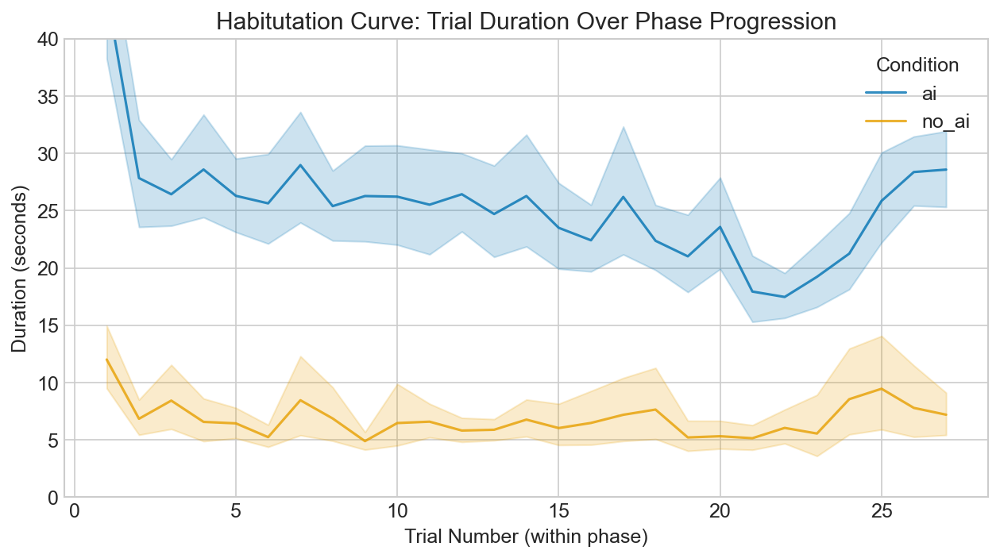

## Section 6: Brittle Benefit / Withdrawal Effect


```text
--- Brittle Benefit / Withdrawal Effect ---
TG=1 (AI first) Accuracy - Session 1 (AI): 0.836
TG=1 (AI first) Accuracy - Session 2 (Control): 0.765
Paired t-test (Session 1 vs 2): t=3.655, p=0.0013
Wilcoxon test (Session 1 vs 2): W=36.0, p=0.0032
```


---
## Notebook: NB3_psychometrics.ipynb

# NB3: Psychometrics as Predictors
- **Question:** Do Big Five personality traits and non-verbal IQ predict annotation accuracy and reliance on AI?
- **Primary GT:** Platinum Consensus
- **KL1 Strategy:** Exclude (Strategy A)
- **Hypothesis:** Higher neuroticism predicts higher over-reliance on AI feedback, and baseline accuracy is modulated by IQ and conscientiousness.
- **Data Note:** The analysis is strictly performed on the **N=51 completer cohort**. Dropouts who did not complete the full study are excluded to ensure data integrity.
- **Data Note:** This notebook uses the finalized **N=51 completer cohort**. All non-completers are excluded.


```text
Data Loading: 51 participants selected (from 68 initial).
Setup Complete. N=51 participants loaded.
```

## Section 1: Descriptive Psychometrics


```text
--- Descriptive Psychometrics ---
       big5_open_mindedness  ...   iq_score
count             51.000000  ...  51.000000
mean               3.774118  ...   1.117647
std                0.627905  ...   1.632753
min                2.500000  ...   0.000000
25%                3.330000  ...   0.000000
50%                3.670000  ...   0.000000
75%                4.210000  ...   2.000000
max                4.920000  ...   6.000000

[8 rows x 6 columns]
```


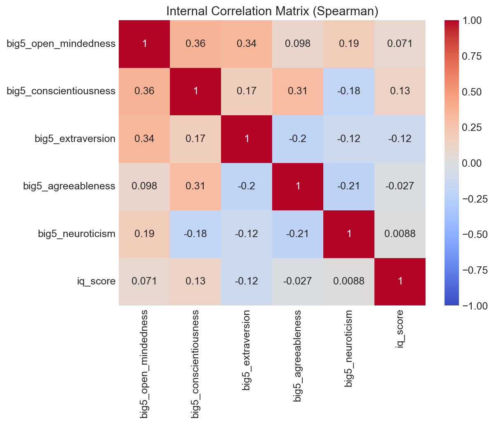


```text

Variance Inflation Factors (VIF > 5 indicates concern):
                 Variable         VIF
0                   const  141.316294
1    big5_open_mindedness    1.468194
2  big5_conscientiousness    1.349282
3       big5_extraversion    1.366464
4      big5_agreeableness    1.254144
5        big5_neuroticism    1.258709
6                iq_score    1.065864
```

## Section 2: Psychometrics and Accuracy


```text
--- Spearman Correlations (FDR Corrected) ---
|    | Condition   | Trait                  |           r |     p_raw |    p_fdr | Sig_raw   | Sig_fdr   |
|---:|:------------|:-----------------------|------------:|----------:|---------:|:----------|:----------|
|  3 | ai          | big5_agreeableness     |  0.243059   | 0.0856808 | 0.265279 |           |           |
|  4 | ai          | big5_neuroticism       |  0.135493   | 0.343126  | 0.514689 |           |           |
|  5 | ai          | iq_score               | -0.0630185  | 0.660428  | 0.792514 |           |           |
|  2 | ai          | big5_extraversion      |  0.0268757  | 0.851499  | 0.952585 |           |           |
|  1 | ai          | big5_conscientiousness | -0.018103   | 0.899663  | 0.952585 |           |           |
|  0 | ai          | big5_open_mindedness   |  0.00158952 | 0.991168  | 0.991168 |           |           |
|  8 | no_ai       | big5_extraversion      |  0.3133     | 0.0251801 | 0.183495 | *         |           |
| 10 | no_ai       | big5_neuroticism       |  0.312333   | 0.0256577 | 0.183495 | *         |           |
|  9 | no_ai       | big5_agreeableness     | -0.271502   | 0.0539531 | 0.242789 |           |           |
| 11 | no_ai       | iq_score               | -0.237707   | 0.0930241 | 0.265279 |           |           |
|  7 | no_ai       | big5_conscientiousness | -0.209646   | 0.139805  | 0.314562 |           |           |
|  6 | no_ai       | big5_open_mindedness   |  0.177934   | 0.211593  | 0.380867 |           |           |
| 16 | overall     | big5_neuroticism       |  0.303155   | 0.0305825 | 0.183495 | *         |           |
| 14 | overall     | big5_extraversion      |  0.230833   | 0.103164  | 0.265279 |           |           |
| 17 | overall     | iq_score               | -0.186942   | 0.188998  | 0.377996 |           |           |
| 13 | overall     | big5_conscientiousness | -0.139045   | 0.330504  | 0.514689 |           |           |
| 12 | overall     | big5_open_mindedness   |  0.0964933  | 0.500571  | 0.693099 |           |           |
| 15 | overall     | big5_agreeableness     | -0.0749319  | 0.60126   | 0.773048 |           |           |

--- GEE Model: Accuracy ~ Psychometrics + Condition ---
|    | Feature                |    coef |   std err |      z |   P>|z| |   [0.025 |   0.975] | Sig   |
|---:|:-----------------------|--------:|----------:|-------:|--------:|---------:|---------:|:------|
|  0 | Intercept              |  0.4303 |     0.609 |  0.707 |   0.48  |   -0.763 |    1.624 |       |
|  1 | C(condition)[T.no_ai]  | -0.153  |     0.114 | -1.348 |   0.178 |   -0.376 |    0.069 |       |
|  2 | iq_score               | -0.0364 |     0.029 | -1.254 |   0.21  |   -0.093 |    0.02  |       |
|  3 | big5_neuroticism       |  0.1854 |     0.07  |  2.65  |   0.008 |    0.048 |    0.323 | *     |
|  4 | big5_conscientiousness | -0.0778 |     0.102 | -0.761 |   0.446 |   -0.278 |    0.123 |       |
|  5 | big5_open_mindedness   | -0.0261 |     0.105 | -0.248 |   0.804 |   -0.233 |    0.18  |       |
|  6 | big5_extraversion      |  0.1619 |     0.098 |  1.649 |   0.099 |   -0.031 |    0.354 |       |
|  7 | big5_agreeableness     |  0.0867 |     0.141 |  0.617 |   0.537 |   -0.189 |    0.362 |       |
```

## Section 3: Psychometrics and Reliance Behavior


```text
--- Reliance Behavior Predictors ---
|    | Trait                  | Outcome       |          r |      p_raw |     p_fdr | Sig_raw   | Sig_fdr   |
|---:|:-----------------------|:--------------|-----------:|-----------:|----------:|:----------|:----------|
|  8 | big5_neuroticism       | over_reliance | -0.389762  | 0.00469565 | 0.0281739 | *         | *         |
|  6 | big5_agreeableness     | over_reliance | -0.197873  | 0.163962   | 0.491887  |           |           |
|  0 | big5_open_mindedness   | over_reliance | -0.134581  | 0.346416   | 0.525738  |           |           |
|  4 | big5_extraversion      | over_reliance | -0.133458  | 0.350492   | 0.525738  |           |           |
| 10 | iq_score               | over_reliance |  0.081832  | 0.568089   | 0.681707  |           |           |
|  2 | big5_conscientiousness | over_reliance | -0.0523275 | 0.715351   | 0.715351  |           |           |

--- GEE Model: Over-Reliance ~ Psychometrics ---
|    | Feature          |    coef |   std err |      z |   P>|z| |   [0.025 |   0.975] | Sig   |
|---:|:-----------------|--------:|----------:|-------:|--------:|---------:|---------:|:------|
|  0 | Intercept        | -1.2632 |     0.348 | -3.626 |   0     |   -1.946 |   -0.58  | *     |
|  1 | iq_score         |  0.0162 |     0.072 |  0.227 |   0.821 |   -0.124 |    0.156 |       |
|  2 | big5_neuroticism | -0.429  |     0.12  | -3.573 |   0     |   -0.664 |   -0.194 | *     |

One-sided p-value for Neuroticism predicting higher Over-Reliance: p = 0.9998
```

## Section 4: Facet-level Analysis


```text
--- Facet-Level Exploratory Analysis ---
```


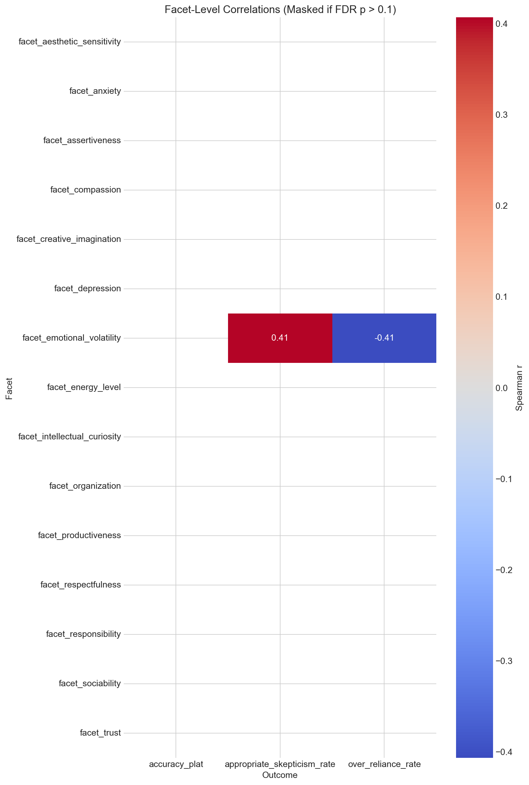

## Section 5: Robustness Under GT Switch


```text
--- GT Switch Robustness ---

OR= Odds Ratios

[ Platinum Ground Truth ]
|                        |   Platinum (OR) |   Platinum (p) | Platinum (*)   |
|:-----------------------|----------------:|---------------:|:---------------|
| Intercept              |           1.538 |          0.48  |                |
| C(condition)[T.no_ai]  |           0.858 |          0.178 |                |
| iq_score               |           0.964 |          0.21  |                |
| big5_neuroticism       |           1.204 |          0.008 | *              |
| big5_conscientiousness |           0.925 |          0.446 |                |
| big5_open_mindedness   |           0.974 |          0.804 |                |
| big5_extraversion      |           1.176 |          0.099 |                |
| big5_agreeableness     |           1.091 |          0.537 |                |

[ Original Ground Truth ]
|                        |   Original (OR) |   Original (p) | Original (*)   |
|:-----------------------|----------------:|---------------:|:---------------|
| Intercept              |           3.57  |          0.001 | *              |
| C(condition)[T.no_ai]  |           0.88  |          0.087 |                |
| iq_score               |           1.001 |          0.948 |                |
| big5_neuroticism       |           1.035 |          0.482 |                |
| big5_conscientiousness |           1.171 |          0.003 | *              |
| big5_open_mindedness   |           1     |          0.996 |                |
| big5_extraversion      |           0.878 |          0.045 | *              |
| big5_agreeableness     |           0.937 |          0.359 |                |
```


---
## Notebook: NB4_integrated_models.ipynb

# NB4: Integrated Predictive Models
- **Question:** What is the combined effect of condition, user traits, and image difficulty on human accuracy? Does confidence mediate the AI benefit?
- **Primary GT:** Platinum Consensus
- **KL1 Strategy:** Exclude (Strategy A)
- **Data Note:** The analysis is strictly performed on the **N=51 completer cohort**. Dropouts are excluded to maintain cohort integrity across all predictive models.
- **Data Note:** This notebook uses the finalized **N=51 completer cohort**. All non-completers are excluded.


```text
Data Loading: 51 participants selected (from 68 initial).
Setup Complete.
```

## Section 1: Candidate GEE Models


```text
--- GEE Candidate Models ---
Model Comparison (QIC - Lower is better):
M0 (Null): 2787.54
M1 (Condition): 2785.42
M2 (+ Traits): 2775.62
M3 (+ Image/AI): 2672.08

--- Final Model (M3) Summary ---
==========================================================================================================
                                             coef    std err          z      P>|z|      [0.025      0.975]
----------------------------------------------------------------------------------------------------------
Intercept                                 -0.2269      0.490     -0.463      0.643      -1.186       0.733
C(condition, Treatment('no_ai'))[T.ai]     0.1588      0.118      1.347      0.178      -0.072       0.390
iq_score                                  -0.0530      0.033     -1.631      0.103      -0.117       0.011
big5_neuroticism                           0.1641      0.075      2.180      0.029       0.017       0.312
big5_conscientiousness                    -0.0364      0.088     -0.412      0.681      -0.210       0.137
gt_plat_kl                                 0.3341      0.054      6.152      0.000       0.228       0.441
ai_correct_plat_int                        0.8404      0.123      6.810      0.000       0.599       1.082
==========================================================================================================
```

## Section 2: Mediation Analysis via Bootstrap
Test: Does user confidence mediate the relationship between AI assistance and accuracy?
Path A: condition -> final_confidence (Linear GEE)
Path B: final_confidence -> human_correct_plat (Logistic GEE controlling for condition)


```text
--- Mediation Analysis (Bootstrap 5000 iterations) ---
Path A (Condition -> Confidence): 0.0552 (p=0.5101)
Path B (Confidence -> Accuracy): 0.4427 (p=0.0000)
Direct Effect (Condition -> Accuracy): 0.1335
Point Estimate of Indirect Effect (A*B): 0.0244
Computing Bootstrap CI (1000 iterations)...
95% CI for Indirect Effect: [-0.0486, 0.0956]
```

## Section 3: Image Difficulty as Moderator


```text
--- Moderation: Does Image Difficulty (KL) moderate AI benefit? ---
=====================================================================================================================
                                                        coef    std err          z      P>|z|      [0.025      0.975]
---------------------------------------------------------------------------------------------------------------------
Intercept                                             0.6935      0.111      6.273      0.000       0.477       0.910
C(condition, Treatment('no_ai'))[T.ai]                0.3579      0.174      2.058      0.040       0.017       0.699
gt_plat_kl                                            0.3354      0.069      4.870      0.000       0.200       0.470
C(condition, Treatment('no_ai'))[T.ai]:gt_plat_kl    -0.1205      0.086     -1.405      0.160      -0.289       0.048
=====================================================================================================================
```


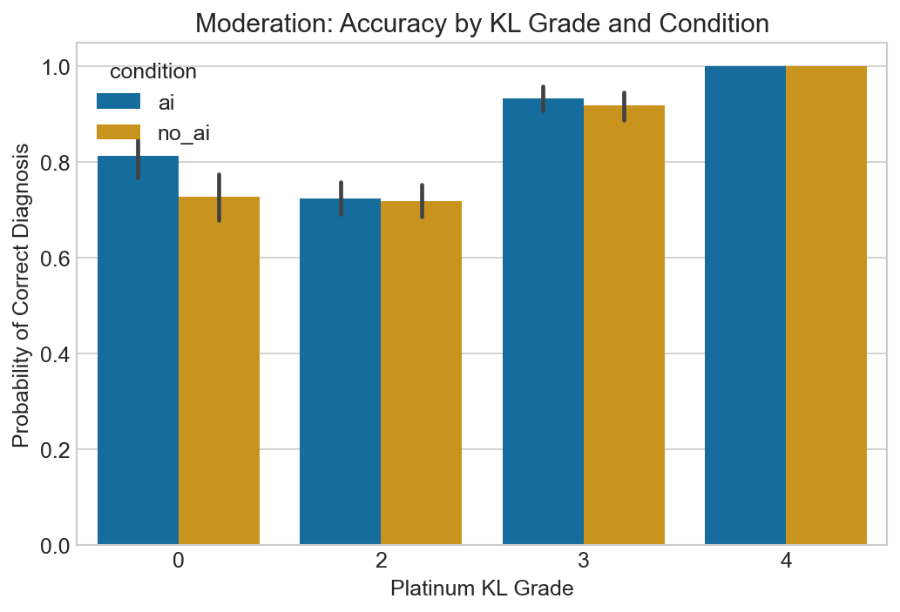

## Section 4: Summary Results Table


```text
--- Publication Results Table ---
|                                        |   ('M1 (Condition)', 'OR') |   ('M1 (Condition)', '2.5%') |   ('M1 (Condition)', '97.5%') |   ('M1 (Condition)', 'p-value') |   ('M2 (+Traits)', 'OR') |   ('M2 (+Traits)', '2.5%') |   ('M2 (+Traits)', '97.5%') |   ('M2 (+Traits)', 'p-value') |   ('M3 (Full)', 'OR') |   ('M3 (Full)', '2.5%') |   ('M3 (Full)', '97.5%') |   ('M3 (Full)', 'p-value') |
|:---------------------------------------|---------------------------:|-----------------------------:|------------------------------:|--------------------------------:|-------------------------:|---------------------------:|----------------------------:|------------------------------:|----------------------:|------------------------:|-------------------------:|---------------------------:|
| Intercept                              |                      3.621 |                        3.066 |                         4.276 |                           0     |                    2.715 |                      1.161 |                       6.349 |                         0.021 |                 0.797 |                   0.305 |                    2.08  |                      0.643 |
| C(condition, Treatment('no_ai'))[T.ai] |                      1.164 |                        0.933 |                         1.453 |                           0.178 |                    1.165 |                      0.933 |                       1.455 |                         0.178 |                 1.172 |                   0.93  |                    1.477 |                      0.178 |
| iq_score                               |                    nan     |                      nan     |                       nan     |                         nan     |                    0.95  |                      0.894 |                       1.01  |                         0.103 |                 0.948 |                   0.89  |                    1.011 |                      0.103 |
| big5_neuroticism                       |                    nan     |                      nan     |                       nan     |                         nan     |                    1.171 |                      1.016 |                       1.349 |                         0.029 |                 1.178 |                   1.017 |                    1.366 |                      0.029 |
| big5_conscientiousness                 |                    nan     |                      nan     |                       nan     |                         nan     |                    0.966 |                      0.817 |                       1.141 |                         0.681 |                 0.964 |                   0.811 |                    1.147 |                      0.681 |
| gt_plat_kl                             |                    nan     |                      nan     |                       nan     |                         nan     |                  nan     |                    nan     |                     nan     |                       nan     |                 1.397 |                   1.256 |                    1.554 |                      0     |
| ai_correct_plat_int                    |                    nan     |                      nan     |                       nan     |                         nan     |                  nan     |                    nan     |                     nan     |                       nan     |                 2.317 |                   1.819 |                    2.951 |                      0     |
```


---
## Notebook: NB5_figures.ipynb

# NB5: Publication Figures
- **Purpose:** Produce all 10 requested publication-quality figures, exported to `.pdf` and `.png`.


```text
Setup complete. Ready to generate figures.
```


```text
Data Loading: 51 participants selected (from 68 initial).
Data Loading: 51 participants selected (from 68 initial).
```

## Figure 1: GT Transition Sankey


```text
Generating Fig 1: GT Transition Sankey
kaleido export failed, you may need to install kaleido. Returning HTML instead.
```


```text
[Plotly Export Failed: Failed to start Kaleido subprocess. Error stream:

[0430/085315.634427:WARNING:resource_bundle.cc(431)] locale_file_path.empty() for locale en-US
[0430/085315.675077:FATAL:mach_port_rendezvous.cc(142)] Check failed: kr == KERN_SUCCESS. bootstrap_check_in org.chromium.Chromium.MachPortRendezvousServer.10066: Permission denied (1100)
0   kaleido                             0x0000000107655c5c base::debug::CollectStackTrace(void**, unsigned long) + 12
1   kaleido                             0x000000010759f0a4 base::debug::StackTrace::StackTrace() + 24
2   kaleido                             0x00000001075b2cb0 logging::LogMessage::~LogMessage() + 188
3   kaleido                             0x0000000107667a50 logging::BootstrapLogMessage::~BootstrapLogMessage() + 168
4   kaleido                             0x0000000107668208 base::MachPortRendezvousServer::MachPortRendezvousServer() + 520
5   kaleido                             0x0000000107667bdc base::MachPortRendezvousServer::GetInstance() + 72
6   kaleido                             0x000000010766d070 base::LaunchProcess(std::__1::vector<std::__1::basic_string<char, std::__1::char_traits<char>, std::__1::allocator<char> >, std::__1::allocator<std::__1::basic_string<char, std::__1::char_traits<char>, std::__1::allocator<char> > > > const&, base::LaunchOptions const&) + 1184
7   kaleido                             0x0000000105fe42e0 content::internal::ChildProcessLauncherHelper::LaunchProcessOnLauncherThread(base::LaunchOptions const&, std::__1::unique_ptr<content::PosixFileDescriptorInfo, std::__1::default_delete<content::PosixFileDescriptorInfo> >, bool*, int*) + 80
8   kaleido                             0x0000000105aaf15c content::internal::ChildProcessLauncherHelper::LaunchOnLauncherThread() + 176
9   kaleido                             0x0000000107607064 base::TaskAnnotator::RunTask(char const*, base::PendingTask*) + 304
10  kaleido                             0x0000000107627f1c base::internal::TaskTracker::RunBlockShutdown(base::internal::Task*) + 28
11  kaleido                             0x0000000107627860 base::internal::TaskTracker::RunTask(base::internal::Task, base::internal::TaskSource*, base::TaskTraits const&) + 716
12  kaleido                             0x00000001076607e0 base::internal::TaskTrackerPosix::RunTask(base::internal::Task, base::internal::TaskSource*, base::TaskTraits const&) + 140
13  kaleido                             0x0000000107627324 base::internal::TaskTracker::RunAndPopNextTask(base::internal::RegisteredTaskSource) + 440
14  kaleido                             0x0000000107630fa0 base::internal::WorkerThread::RunWorker() + 656
15  kaleido                             0x0000000107630cf4 base::internal::WorkerThread::RunDedicatedWorker() + 16
16  kaleido                             0x0000000107660d58 base::(anonymous namespace)::ThreadFunc(void*) + 108
17  libsystem_pthread.dylib             0x0000000183487c58 _pthread_start + 136
18  libsystem_pthread.dylib             0x0000000183482c1c thread_start + 8
Task trace:
0   kaleido                             0x0000000105aaefd8 content::internal::ChildProcessLauncherHelper::StartLaunchOnClientThread() + 244
1   kaleido                             0x000000010606fe5c content::VizProcessTransportFactory::ConnectHostFrameSinkManager() + 424

/Users/baltaymarci/Documents/Feel Good AI/Analysis/venv/lib/python3.9/site-packages/kaleido/executable/kaleido: line 5: 10066 Trace/BPT trap: 5       "./bin/kaleido" "$@"
]
```

## Figure 2: Label Noise Summary (Two-panel)


```text
Generating Fig 2: Label Noise Summary
```


## Figure 3: Accuracy Paradox


```text
Generating Fig 3: Accuracy Paradox
Data Loading: 51 participants selected (from 68 initial).
```


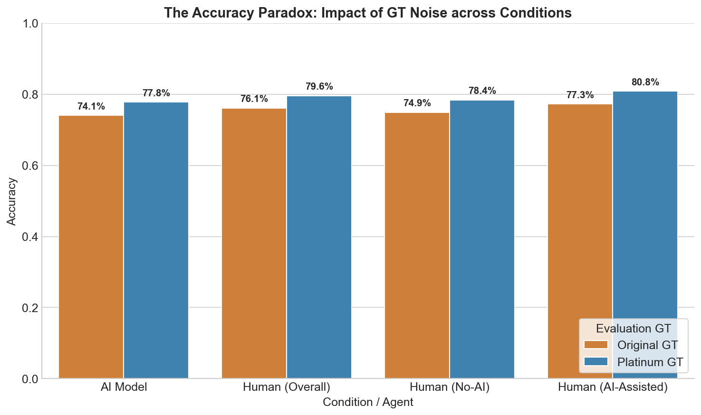

## Figure 4: Reliance Taxonomy


```text
Generating Fig 4: Reliance Taxonomy
```


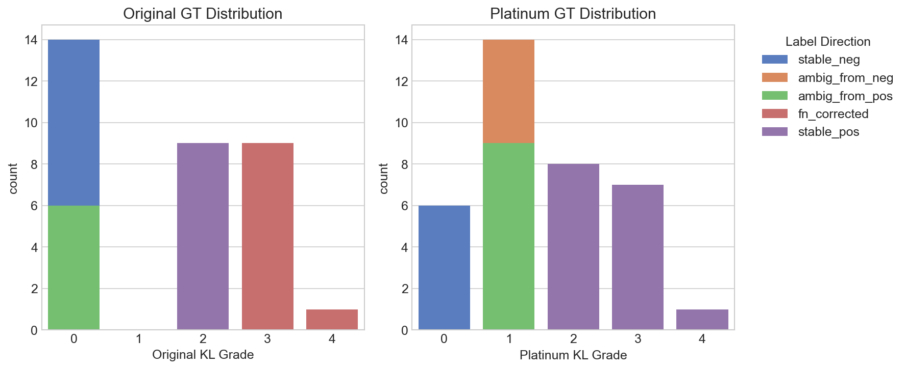

## Figure 5: AI Confidence on Mislabeled Images


```text
Generating Fig 5: AI Confidence on Mislabeled Images
```


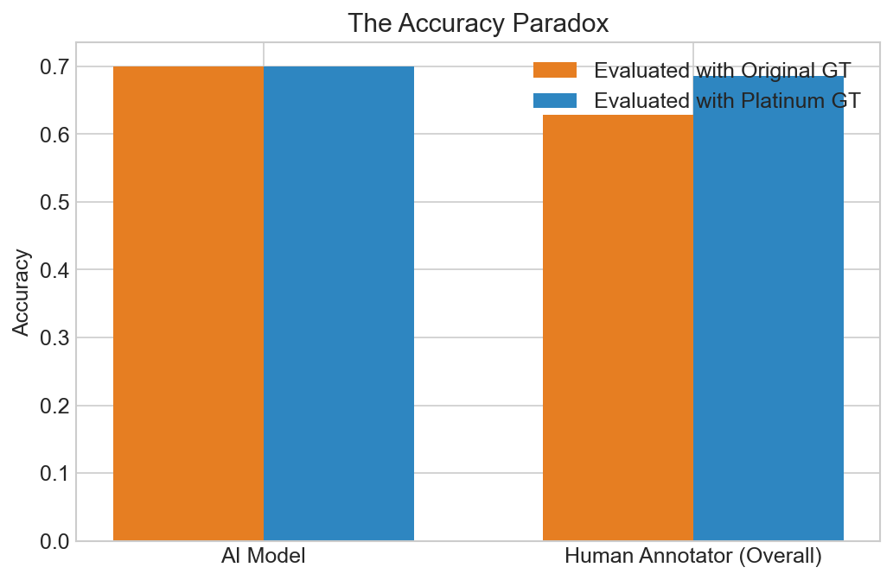

## Figure 6: Decision Flip Map


```text
Generating Fig 6: Decision Flip Map
```


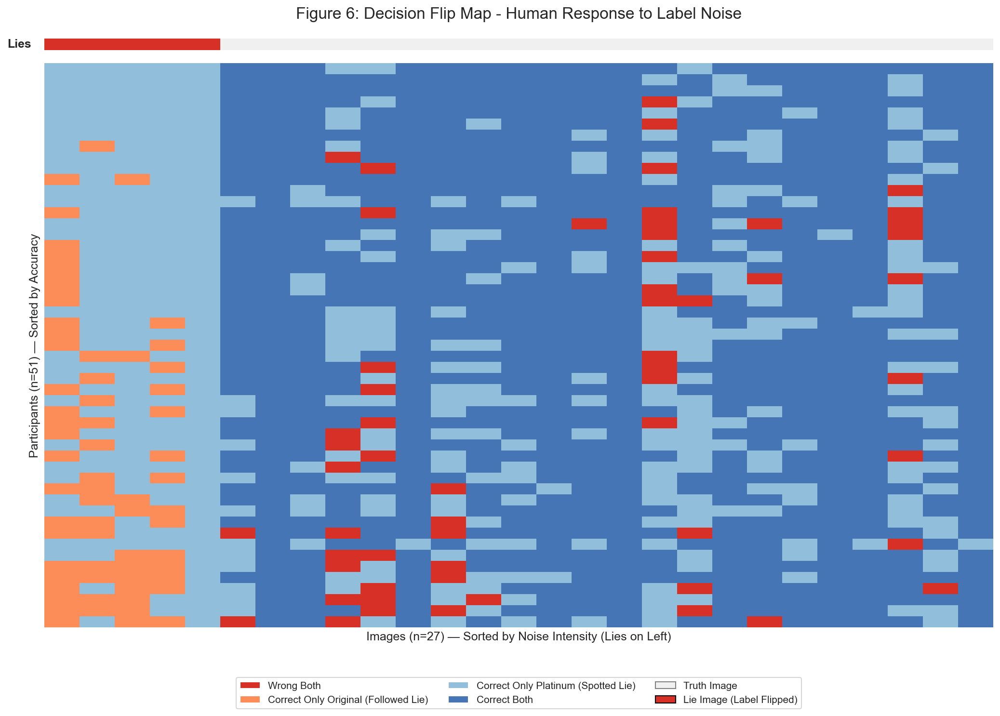

## Figure 7: Calibration Curves


```text
Generating Fig 7: Calibration Curves
```


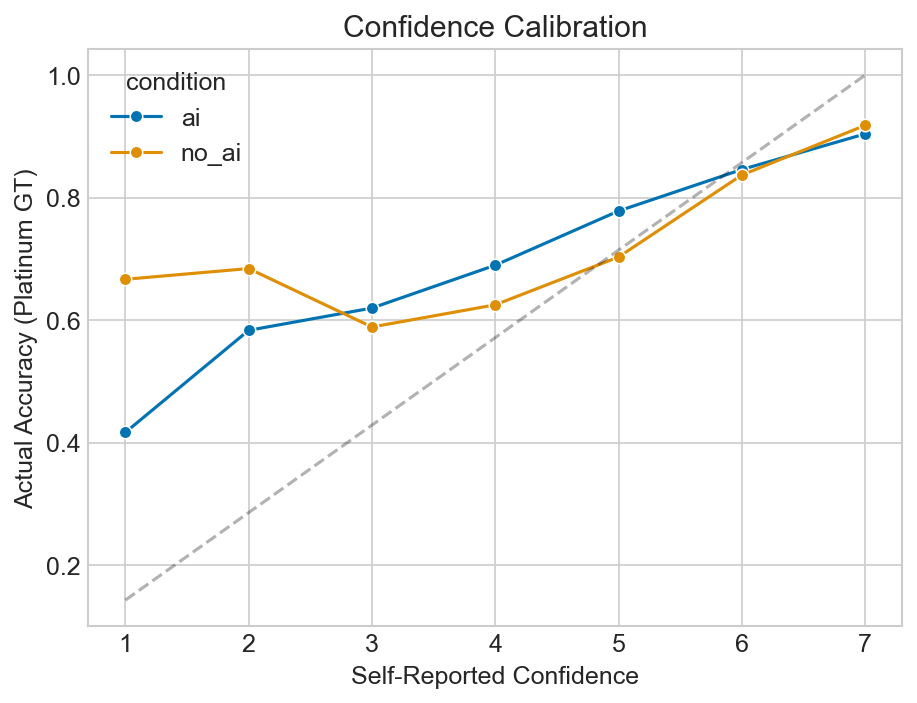

## Figure 8: Psychometric Heatmap


```text
Generating Fig 8: Psychometric Heatmap
```


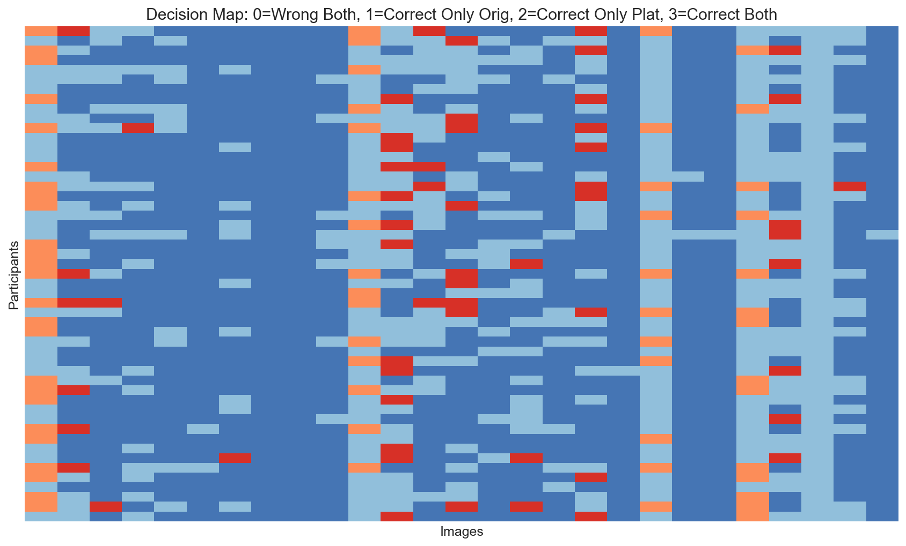

## Figure 9: Learning Curves


```text
Generating Fig 9: Learning Curves
```


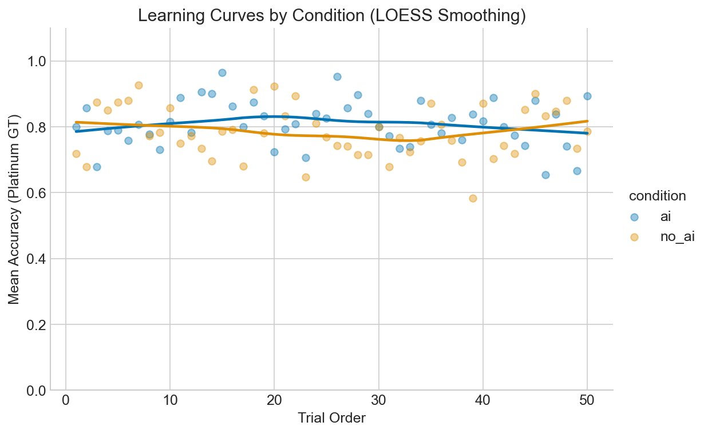

## Figure 10: Model Comparison


```text
Generating Fig 10: Model Comparison Coefficient Plot
```


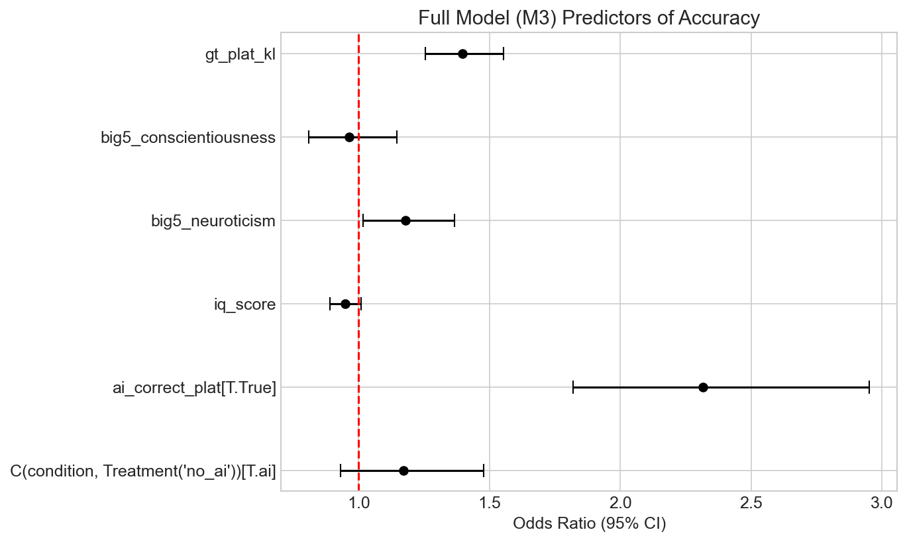
