# Original Analysis Summary

This report summarizes the results from the initial analysis workflow.


---
## Notebook: NB0_data_loading.ipynb

# NB0 — Data Loading & Quality Dashboard

**Purpose**: Load, clean, validate, and explore the PerCoTate dataset.  
This notebook is purely descriptive — no hypothesis testing.  
All subsequent notebooks import from `helpers.py` which implements the same loading/cleaning pipeline.

---


```text
CSV path: /Users/baltaymarci/Documents/Feel Good AI/Analysis/Original Analysis/../data/participants.csv
```

## 1. Load & Clean


```text
Total rows:           5,950
Columns:              79
Unique participants:  68
Completers:           51
Dropouts:             17
```

## 2. Data Types & Missing Values


```text
Columns with missing values: 43

|                              |   missing_count |   missing_pct |
|:-----------------------------|----------------:|--------------:|
| final_confidence             |            2900 |          48.7 |
| decision_changed             |            2900 |          48.7 |
| phase1_video_watched         |            2900 |          48.7 |
| reverted_decision            |            2900 |          48.7 |
| symptom1                     |            2900 |          48.7 |
| symptom2                     |            2900 |          48.7 |
| pre_ai_correct               |            2900 |          48.7 |
| ai_correct                   |            2900 |          48.7 |
| changed_to_correct           |            2900 |          48.7 |
| final_decision               |            2900 |          48.7 |
| changed_to_incorrect         |            2900 |          48.7 |
| agreed_with_ai               |            2900 |          48.7 |
| over_reliance                |            2900 |          48.7 |
| skepticism                   |            2900 |          48.7 |
| confidence_shift             |            2900 |          48.7 |
| symptom1_en                  |            2900 |          48.7 |
| initial_confidence           |            2900 |          48.7 |
| symptom2_en                  |            2900 |          48.7 |
| phase2_completed_at          |             850 |          14.3 |
| facet_responsibility         |             500 |           8.4 |
| facet_emotional_volatility   |             500 |           8.4 |
| big5_extraversion            |             500 |           8.4 |
| big5_neuroticism             |             500 |           8.4 |
| big5_open_mindedness         |             500 |           8.4 |
| big5_timestamp               |             500 |           8.4 |
| facet_aesthetic_sensitivity  |             500 |           8.4 |
| facet_anxiety                |             500 |           8.4 |
| facet_assertiveness          |             500 |           8.4 |
| facet_compassion             |             500 |           8.4 |
| facet_creative_imagination   |             500 |           8.4 |
| facet_depression             |             500 |           8.4 |
| facet_energy_level           |             500 |           8.4 |
| facet_sociability            |             500 |           8.4 |
| facet_intellectual_curiosity |             500 |           8.4 |
| facet_organization           |             500 |           8.4 |
| iq_time_remaining            |             500 |           8.4 |
| iq_score                     |             500 |           8.4 |
| iq_completed_at              |             500 |           8.4 |
| facet_productiveness         |             500 |           8.4 |
| facet_respectfulness         |             500 |           8.4 |
| big5_conscientiousness       |             500 |           8.4 |
| facet_trust                  |             500 |           8.4 |
| big5_agreeableness           |             500 |           8.4 |
```


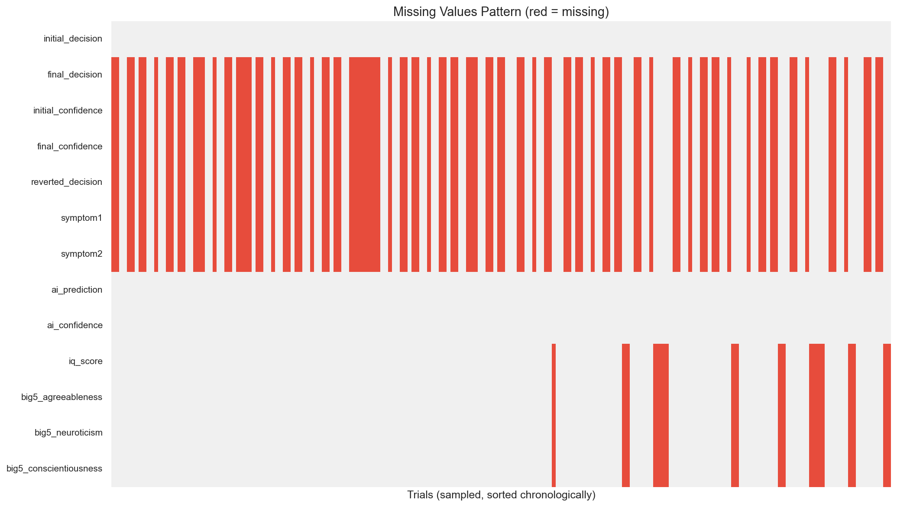

## 3. Participant Demographics


```text
=== Participant Demographics ===
N = 68
  Completers: 51 | Dropouts: 17
  Gender: {'female': 35, 'male': 33}
  Age: mean=16.3, SD=0.7, range=[15, 18]
  School: {'secondary': 61, 'primary': 7}
  Residence: {'budapest': 48, 'city': 13, 'village': 7}
  Treatment group: {'0': 34, '1': 34}
```


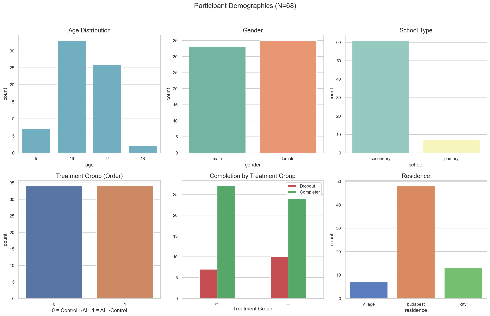

## 4. Ground Truth & Class Balance


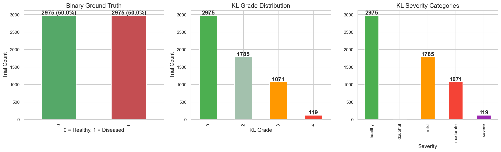


```text

Binary mapping: KL0→Healthy(0), KL1→Doubtful(1), KL2-4→Diseased(1)
Class balance: 50.0% Healthy vs 50.0% Diseased
```

## 5. AI Model Audit


```text
AI Overall Accuracy: 70.0% (n=3050 trials)
```


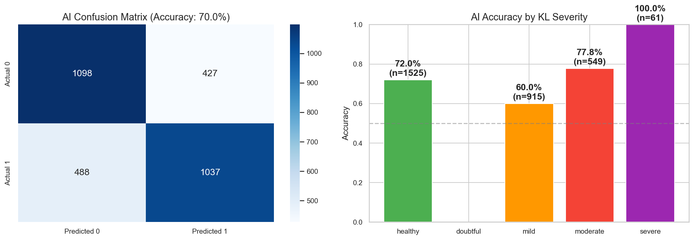


```text

AI Classification Report:
              precision    recall  f1-score   support

 Healthy (0)       0.69      0.72      0.71      1525
Diseased (1)       0.71      0.68      0.69      1525

    accuracy                           0.70      3050
   macro avg       0.70      0.70      0.70      3050
weighted avg       0.70      0.70      0.70      3050

```


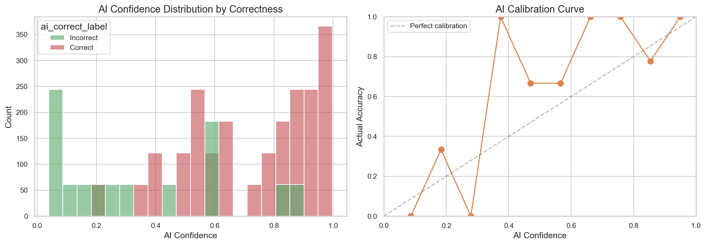

## 6. Speeder Detection

Exploring multiple methods to identify participants who are not engaging genuinely with the task.


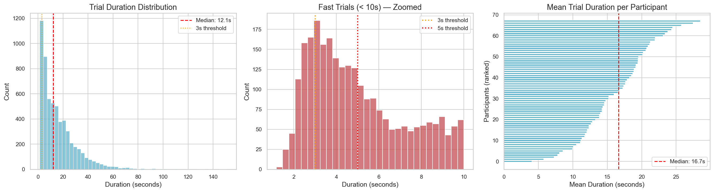


```text
Duration stats: min=1.2s, median=12.1s, mean=16.4s, max=151.0s
Trials < 3s: 538 (9.0%)
Trials < 5s: 1537 (25.8%)
```


```text
|    | Method         |   Flagged Trials | Flagged %   |   Flagged Participants | Acc (flagged)   | Acc (normal)   |
|---:|:---------------|-----------------:|:------------|-----------------------:|:----------------|:---------------|
|  0 | Fixed < 3s     |              538 | 9.0%        |                      0 | 68.2%           | 62.4%          |
|  1 | Fixed < 5s     |             1537 | 25.8%       |                      2 | 65.1%           | 62.2%          |
|  2 | Z-score < -2   |                0 | 0.0%        |                      0 | N/A             | 62.9%          |
|  3 | 5th percentile |              297 | 5.0%        |                      0 | 66.0%           | 62.7%          |

→ This table helps decide which speeder threshold to use.
  A good threshold flags trials with notably lower accuracy.
```

## 7. Dropout Characterization


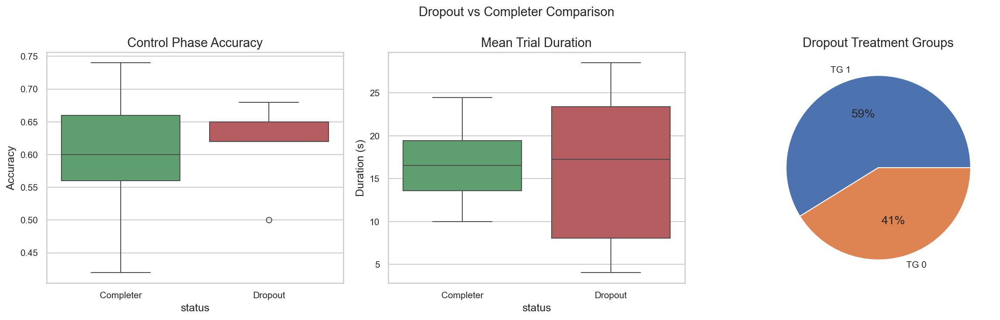


```text
Dropouts: 17 participants
  TG=0 dropouts: 7 (had Control only → have psychometrics)
  TG=1 dropouts: 10 (had AI only → NO psychometrics)
```

## 8. Quick Overview — Key Variable Distributions


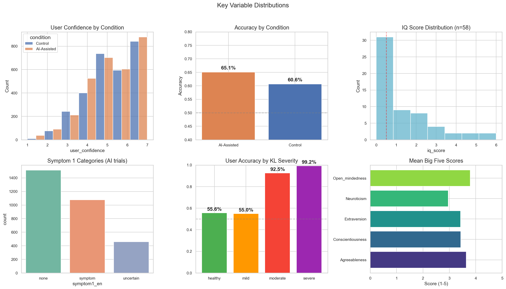

## 9. Crossover Design Verification

Verify the experimental structure: Phase 1 → Phase 2 crossover.


```text
Crossover Design Verification:
Phase 1      Phase 2    
Control      AI-Assisted    27
AI-Assisted  Control        24
Name: count, dtype: int64

Phase × Condition trial counts (completers only):
| phase   |   AI-Assisted |   Control |
|:--------|--------------:|----------:|
| Phase 1 |          1200 |      1350 |
| Phase 2 |          1350 |      1200 |

✓ Confirms: TG=0 → Phase1=Control, Phase2=AI | TG=1 → Phase1=AI, Phase2=Control
```

## Findings & Next Steps

**Key Data Quality Observations:**
1. Data is clean — missing values follow expected patterns (control trials lack AI-phase fields)
2. Crossover design verified: 51 completers, 17 dropouts (all Phase 1 only)
3. Class balance is roughly 50/50 (healthy vs diseased)
4. AI accuracy is ~70% as expected
5. 31/58 participants with IQ data scored 0 — critical subgroup to analyze

**Speeder threshold decision**: Review the comparison table above and decide which method to use for subsequent analyses.

**Next**: Proceed to NB1 (Performance & Accuracy) for hypothesis testing.


---
## Notebook: NB1_performance_accuracy.ipynb

# NB1 — Performance & Accuracy Analysis

**Purpose**: Core hypothesis testing on human accuracy with and without AI assistance.  
Covers control vs AI accuracy, crossover analysis, order effects, self-correction, KL-grade stratification, and AI influence analysis.

---


```text
Loaded: 5950 trials, 68 participants
Completers: 51, Dropouts: 17
```

## 1. Overall Accuracy: Control vs AI-Assisted

Primary comparison using two approaches:
- **All participants** (independent samples, includes dropouts)
- **Completers only** (paired, within-subject — highest power)


```text
=== All Participants (Independent Samples) ===
Control: n=58, M=0.606, SD=0.069
AI-Assisted: n=61, M=0.651, SD=0.088
Independent t-test: t=3.051, p=0.0028, Cohen's d=0.560
Mann-Whitney U: U=2298, p=0.0048
```


```text
=== Completers Only (Paired, Within-Subject) ===
Control: M=0.604, SD=0.071
AI-Assisted: M=0.653, SD=0.090
Difference: M=0.049, SD=0.110
Paired t-test: t=3.167, p=0.0026, Cohen's d (paired)=0.601
Wilcoxon signed-rank: W=314, p=0.0030
95% CI for AI-Control difference: [0.018, 0.079]
```


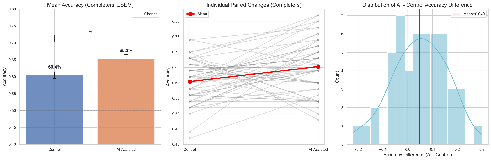

## 2. Order Effects (Crossover Analysis)

Does the order matter? Compare TG=0 (Control first → then AI) vs TG=1 (AI first → then Control).


```text
=== 2×2 Mixed ANOVA (Condition × Order) ===
            Source  DF1  DF2       F   p-unc     np2
0  treatment_group    1   49  1.3236  0.2555  0.0263
1        condition    1   49  9.8470  0.0029  0.1673
2      Interaction    1   49  0.0737  0.7872  0.0015
```


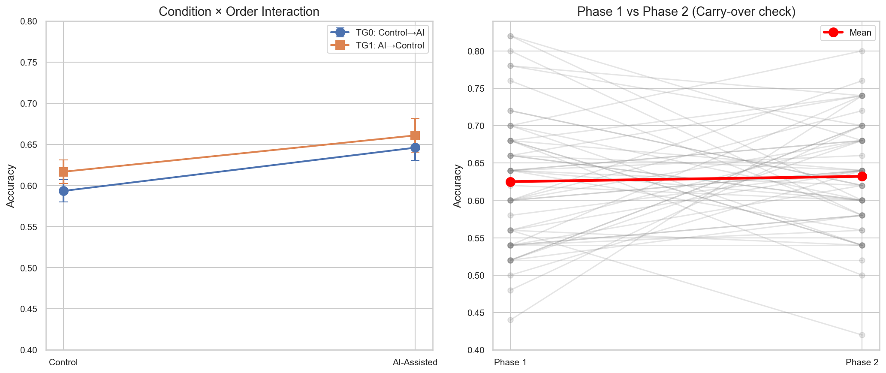


```text
Phase 1 vs 2: t=0.420, p=0.6760
```

## 3. AI Influence: Pre-AI vs Post-AI Accuracy

For AI-Assisted trials, compare initial_decision accuracy (before seeing AI) with final_decision accuracy (after seeing AI).  
This directly measures the AI's trial-level influence.


```text
=== AI Influence (Trial-Level) ===
Pre-AI accuracy (initial_decision):  0.599
Post-AI accuracy (final_decision):   0.651
AI boost (post - pre):               0.052
AI model accuracy:                   0.700

McNemar contingency: a=1759, b=68 (hurt by AI), c=226 (helped by AI), d=997
McNemar test: χ²=84.912, p=0.0000
Trials helped by AI: 226 (7.4%)
Trials hurt by AI:   68 (2.2%)
```


```text
=== AI Influence (Participant-Level) ===
Mean Pre-AI accuracy:  0.599
Mean Post-AI accuracy: 0.651
Mean AI boost:         0.052
Paired t-test: t=6.989, p=0.0000, d=0.646

Participants benefited: 46 (75%)
Participants hurt:     4 (7%)
Unchanged:             11
```


```text
=== Baseline Comparison: Control vs Experimental Pre-AI Accuracy ===
Control initial accuracy: 0.606 (n=58)
Experimental pre-AI accuracy: 0.599 (n=61)

--- Completers (paired) ---
Control: 0.604, Exp pre-AI: 0.604
Paired t-test: t=-0.030, p=0.9765
(Non-significant → baselines are equivalent, AI effect is real)
```


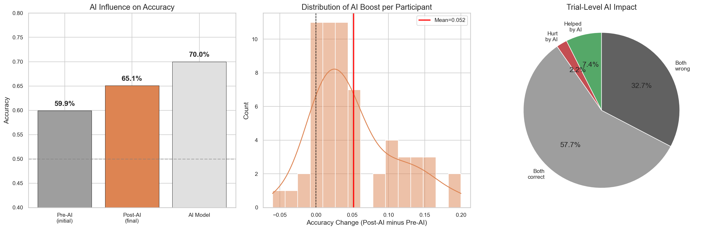

## 4. Self-Correction Analysis

When users change their decision after seeing AI (initial ≠ final), how often is it a correction vs an error?


```text
=== Decision Changes in AI Trials ===
Total AI trials: 3050
Decision changed: 294 (9.6%)
Decision kept:    2756 (90.4%)

Of changes:
  Corrections (wrong→right): 226 (76.9%)
  Errors (right→wrong):      68 (23.1%)
  Net benefit:               158 trials

Changed TO agree with AI:   279 (94.9%)
Changed AWAY from AI:       15 (5.1%)
```


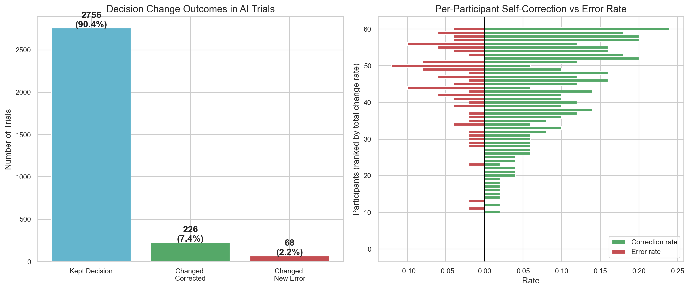

## 5. Accuracy by KL Severity Grade


```text
=== Accuracy by KL Severity × Condition ===
condition    AI-Assisted  Control
kl_severity                      
healthy            0.572    0.539
doubtful             NaN      NaN
mild               0.597    0.500
moderate           0.923    0.927
severe             0.984    1.000

--- Chi-square tests per KL grade ---
  healthy: χ²=3.18, p=0.0745 (Control=53.9% vs AI=57.2%)
  mild: χ²=16.47, p=0.0000 (Control=50.0% vs AI=59.7%)
  moderate: χ²=0.01, p=0.9090 (Control=92.7% vs AI=92.3%)
  severe: χ²=0.00, p=1.0000 (Control=100.0% vs AI=98.4%)
```


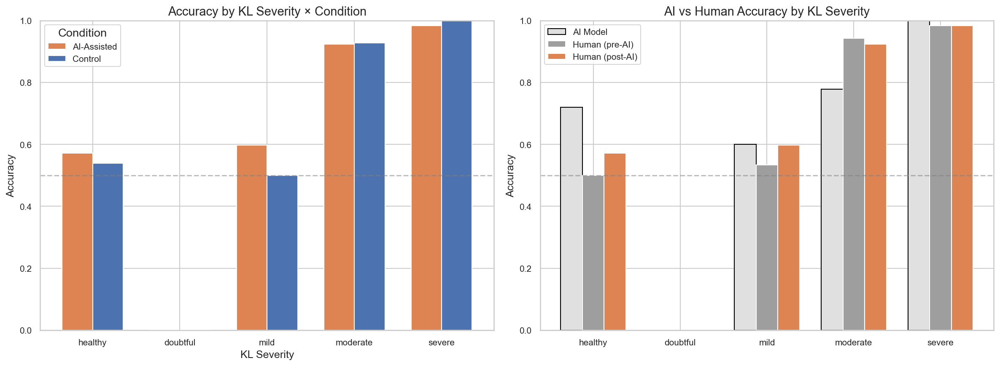

## 6. IQ=0 Sensitivity Analysis

31 of 58 participants with IQ data scored 0. Exploring performance with and without them.


```text
=== IQ=0 vs IQ>0 Performance Comparison ===

IQ=0 (n=31):
  Overall accuracy:       0.624 ± 0.057
  Control accuracy:       0.606
  AI accuracy:            0.647
  Mean trial duration:    14.5s

IQ>0 (n=27):
  Overall accuracy:       0.632 ± 0.062
  Control accuracy:       0.607
  AI accuracy:            0.659
  Mean trial duration:    16.5s

IQ>0 vs IQ=0: t=0.512, p=0.6105, d=0.135

=== Sensitivity: Main Result Excluding IQ=0 ===
Completers excl. IQ=0 (n=24):
  Control: 0.603, AI: 0.659
  Paired t: t=2.840, p=0.0093, d=0.696
```


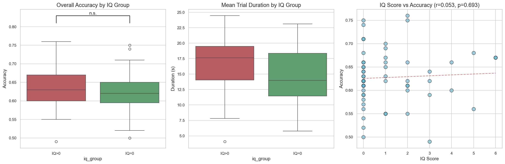

## 7. Chance-Level Participant Detection & Sensitivity Analysis


```text
§7a. Binomial Test: Are Participants Above Chance?
 
Total participants: 68
Significantly above chance (p<0.05): 51 (75.0%)
NOT significantly above chance:      17 (25.0%)

Above-chance group: M=0.654, SD=0.046
At-chance group:    M=0.557, SD=0.050

--- Breakdown by Condition ---
Above-chance: Control=0.624, AI=0.677
At-chance:    Control=0.551, AI=0.555

Control phase: 23/58 above chance (39.7%)
AI phase: 39/61 above chance (63.9%)

§7b. Sensitivity: Main Result Excluding At-Chance Participants
Engaged completers: n=41
Control: M=0.621
AI:      M=0.676
Paired t: t=3.027, p=0.0043, d=0.473

```


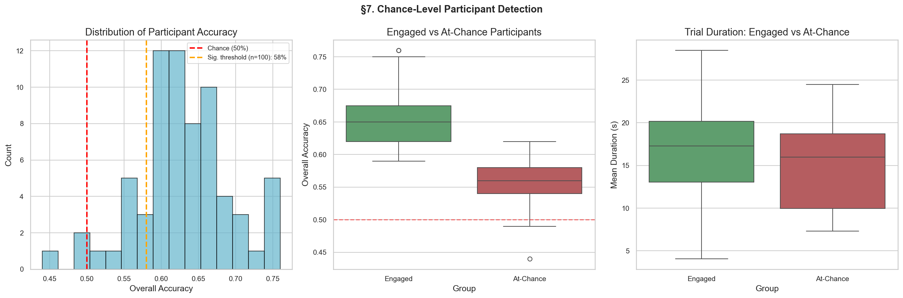

## 8. Speed vs Accuracy: Is Faster = Worse?


```text
§8a. Speed vs Accuracy (Participant-Level)
 
  Spearman: r=0.119, p=0.3331
  Pearson:  r=0.096, p=0.4361

  Control: r=-0.072, p=0.5922 (n=58)
  AI-Assisted: r=0.063, p=0.6309 (n=61)

--- Accuracy by Speed Quartile ---
                mean_accuracy  std_accuracy  mean_duration   n
speed_quartile                                                
Q1 (fastest)            0.615         0.055          9.745  17
Q2                      0.649         0.063         14.260  17
Q3                      0.622         0.084         18.466  17
Q4 (slowest)            0.632         0.042         22.914  17

Trial-level speed vs accuracy: r=0.001, p=0.9658


```


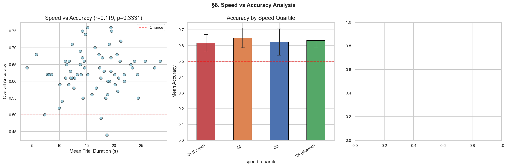

## 9. Batch Effect Test (Two Classroom Cohorts)


```text
Batch distribution (participants):
batch
1    34
2    34
Name: count, dtype: int64

batch          1     2
date                  
2026-02-05  1650     0
2026-02-06     0  1299
2026-03-05  1448     0
2026-03-06     2  1551
============================================================
§9. Batch Effect Test
============================================================
Batch 1: n=34
Batch 2: n=34

Metric                       Batch1 M(SD)       Batch2 M(SD)            t       p Sig
------------------------------------------------------------------------------------------
  Overall Accuracy           0.632(0.060)   0.626(0.066)    +0.38  0.7031  
  Control Accuracy           0.593(0.070)   0.621(0.067)    -1.56  0.1251  
  AI Accuracy                0.663(0.085)   0.638(0.092)    +1.09  0.2823  
  Over-Reliance Rate         0.149(0.042)   0.161(0.036)    -1.25  0.2149  
  Skepticism Rate            0.189(0.083)   0.201(0.097)    -0.52  0.6074  
  Mean Duration (s)          17.448(5.210)   15.245(5.153)    +1.75  0.0843  
  Extraversion               3.439(0.739)   3.414(0.637)    +0.14  0.8922  
  Neuroticism                3.056(0.799)   2.851(0.750)    +1.01  0.3192  
  Conscientiousness          3.603(0.635)   3.247(0.743)    +1.96  0.0547  

── Demographic Distribution by Batch ──
  gender: χ²=0.00, p=1.0000
  school: χ²=0.64, p=0.4248
  treatment_group: χ²=0.00, p=1.0000

```


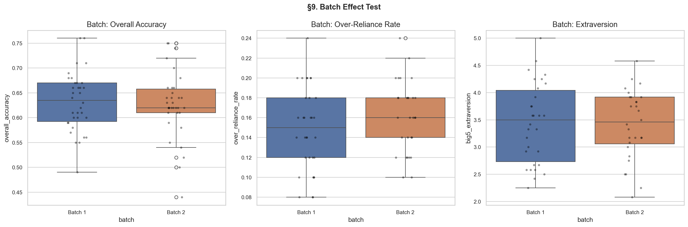


```text
INTERPRETATION:
  If any metric is significant (marked *), batch is a confound
  that should be controlled for in the personality analyses.
  If nothing is significant, batches are equivalent — report as such.
```

## Findings & Next Steps

**Summarize key findings here after running the notebook:**

1. Control vs AI accuracy comparison (paired & independent)
2. Order effects (any significant interaction?)
3. AI influence magnitude (pre vs post accuracy)
4. Self-correction: net benefit of decision changes
5. KL severity: which grades are hardest?
6. IQ=0 sensitivity: does exclusion change the main result?

**Next**: NB2 for detailed Human-AI interaction analysis (over-reliance, skepticism, calibration).


---
## Notebook: NB2_human_ai_interaction.ipynb

# NB2 — Human-AI Interaction Analysis

**Purpose**: Dissect how users interact with AI predictions.  
Covers over-reliance, skepticism, agreement rates, confidence calibration, symptom analysis, and reversion behavior.

---


```text
AI trials: 3050, Participants with AI data: 61
```

## 1. Agreement, Over-reliance & Skepticism Rates


```text
=== Human-AI Interaction Rates ===
Agreement rate (final == ai_prediction):  0.660
Over-reliance (agree with WRONG AI):      0.155
Skepticism (reject CORRECT AI):           0.194

When AI is CORRECT (n=2135):
  Followed AI: 0.722
  Skepticism:  0.278
When AI is WRONG (n=915):
  Followed AI (over-reliance): 0.516
  Rejected AI:                 0.484
```


```text
=== Outcome Matrix ===
   ai_correct agreed_with_ai  count  user_acc  % of trials
0    AI Wrong    Rejected AI    443       1.0         14.5
1    AI Wrong    Followed AI    472       0.0         15.5
2  AI Correct    Rejected AI    593       0.0         19.4
3  AI Correct    Followed AI   1542       1.0         50.6
```


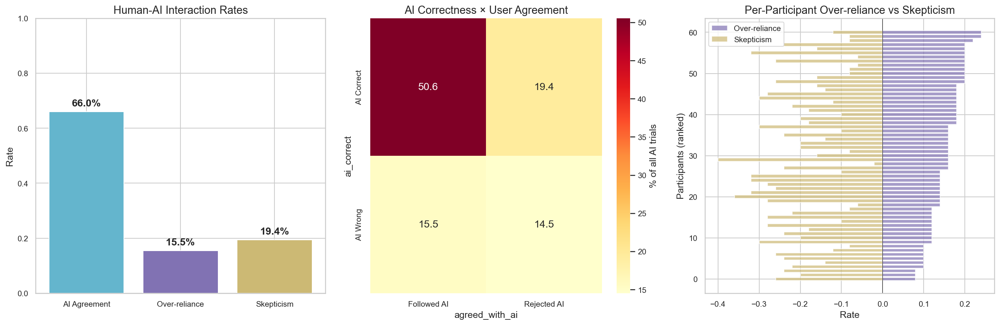

## 2. AI Confidence Effect

Does higher `ai_confidence` lead to more agreement and higher over-reliance?


```text
=== Agreement & Accuracy by AI Confidence Quartile ===
                  agreement_rate  over_reliance_rate  ...  n_trials  mean_conf
ai_conf_quartile                                      ...                     
Q1 (low)                   0.585               0.407  ...       793      0.196
Q2                         0.541               0.108  ...       732      0.548
Q3                         0.646               0.024  ...       793      0.781
Q4 (high)                  0.877               0.070  ...       732      0.946

[4 rows x 7 columns]

Spearman: AI confidence → Agreement: r=0.212, p=0.0000
```


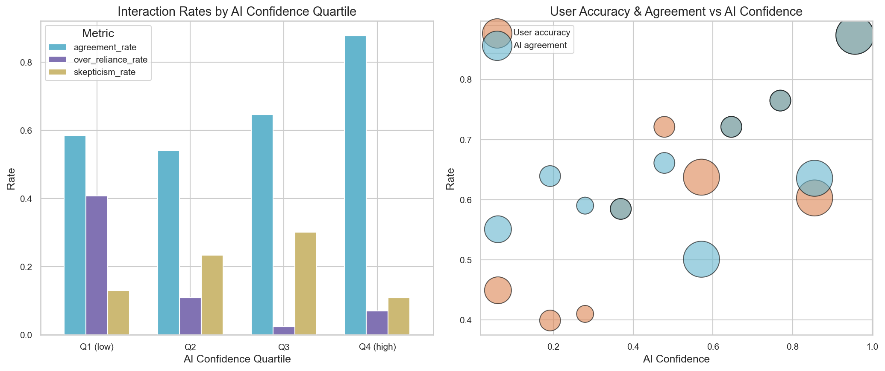

## 3. Confidence Calibration


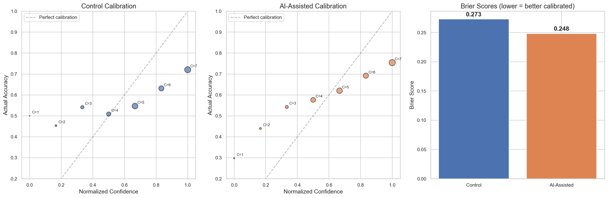

## 4. Confidence Shift Analysis

How does seeing AI prediction change user confidence?


```text
=== Confidence Shift in AI Trials ===
Mean shift: 0.219
Shift when decision CHANGED: 0.041
Shift when decision KEPT:    0.238

Agreed with AI: mean shift = 0.484 (n=2014)
Disagreed with AI: mean shift = -0.297 (n=1036)

AI was correct: mean shift = 0.273 (n=2135)
AI was wrong: mean shift = 0.092 (n=915)
```


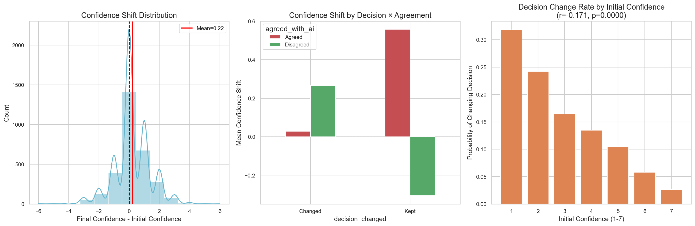

## 5a. Symptom Category Analysis

Do users who report "uncertain" (bizonytalan) show different AI interaction patterns?


```text
=== Symptom Category Analysis ===
             n_trials  user_accuracy  ...  decision_changed  mean_confidence
symptom1_en                           ...                                   
none             1514          0.623  ...             0.100            5.266
symptom          1076          0.689  ...             0.072            5.699
uncertain         460          0.654  ...             0.141            4.650

[3 rows x 7 columns]

Chi-square (symptom1 × accuracy): χ²=12.016, p=0.0025
```


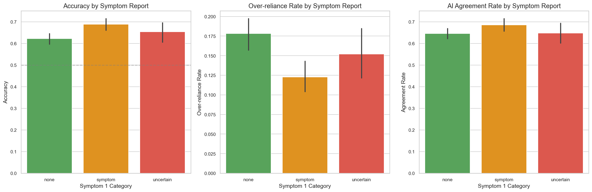

## 5b. Metacognition Check: Do "Uncertain" Reports Track Image Difficulty?


```text
§5b. Metacognition: Do Uncertain Reports Track Image Difficulty?
  Spearman r(uncertain_rate ~ human_accuracy) = -0.215, p = 0.1342

── Mean Uncertainty Rate: Ambiguous vs Clear Images ──
                   mean    std  count
difficulty_group                     
Ambiguous (KL2)   0.161  0.042     15
Clear (KL0)       0.155  0.054     25
Clear (KL3)       0.118  0.054      9
Clear (KL4)       0.197    NaN      1

── Trial-Level: Uncertain vs Non-Uncertain Reporters ──
  Uncertain trials: 460 | Other: 2590
```


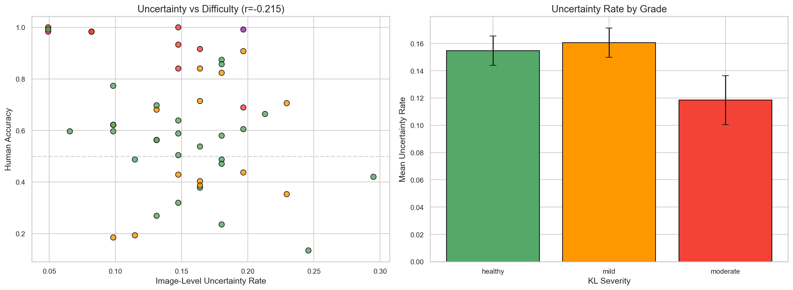

## 6. Reversion Analysis

When users use the "revert" button (changing their decision), what drives it?


```text
=== Reversion Analysis ===
Total AI trials with revert data: 3050
Reverted: 294 (9.6%)

Accuracy when reverted:     0.769
Accuracy when NOT reverted: 0.638

Reversion TO AI:   279 (94.9%)
Reversion AWAY from AI: 15 (5.1%)

Accuracy when reverted TO AI:   0.774
Accuracy when reverted AWAY:    0.667
```


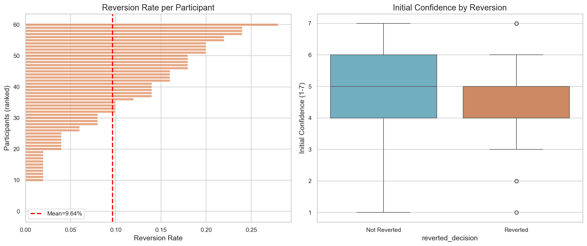

## Findings & Next Steps

**Summarize after running:**

1. Overall over-reliance vs skepticism balance
2. AI confidence effect: does higher AI confidence drive more agreement?
3. Calibration quality across conditions
4. Confidence shift patterns
5. Symptom category effects on interaction
6. Reversion patterns and their outcomes

**Next**: NB3 for temporal dynamics and fatigue analysis.


---
## Notebook: NB3_temporal_dynamics.ipynb

# NB3 — Temporal Dynamics & Fatigue Analysis

**Purpose**: Model how performance changes over the 50-trial sequence within each phase.  
Covers learning curves, speed trends, fatigue detection, AI reliance drift, and carry-over effects.

---


```text
Total trials: 5950, Completers: 51
```

## 1. Learning Curves: Accuracy Over Trials


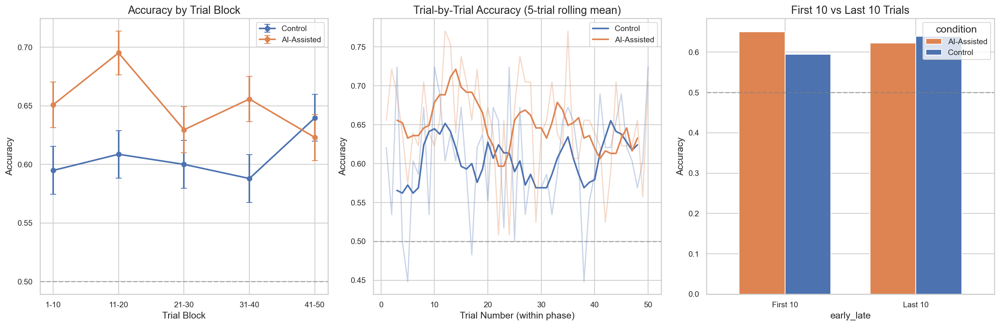


```text
Control: First 10 (0.595) vs Last 10 (0.640): t=-1.571, p=0.1165
AI-Assisted: First 10 (0.651) vs Last 10 (0.623): t=1.012, p=0.3119
```

## 2. Speed Trends: Trial Duration Over Time


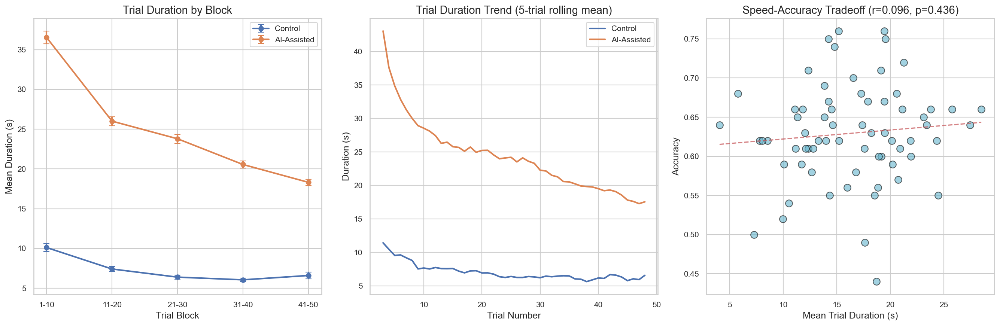


```text
Control duration trend: r=-0.145, p=0.0000 (negative = speeding up)
AI-Assisted duration trend: r=-0.401, p=0.0000 (negative = speeding up)
```

## 3. Fatigue Crash Detection

Is there a specific point where accuracy drops sharply?


```text
=== Half-Phase Accuracy Comparison ===
Control: First half (0.604) vs Second half (0.608): t=-0.228, p=0.8197
AI-Assisted: First half (0.658) vs Second half (0.644): t=0.797, p=0.4252
```


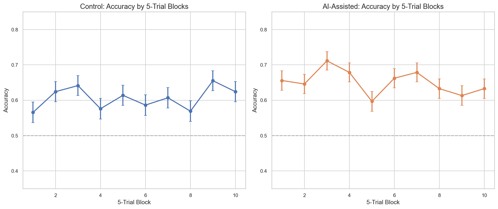

## 4. AI Reliance Over Time

Does over-reliance on AI increase as participants get fatigued?


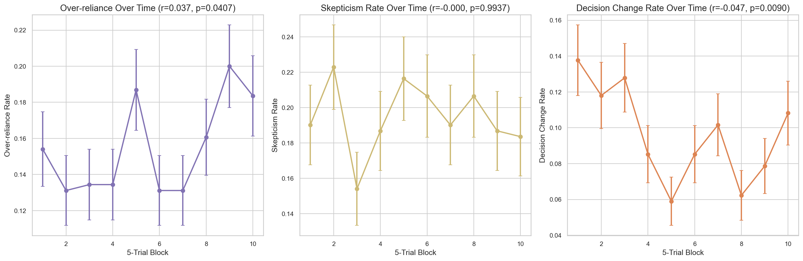

## 5. Confidence Trends Over Time


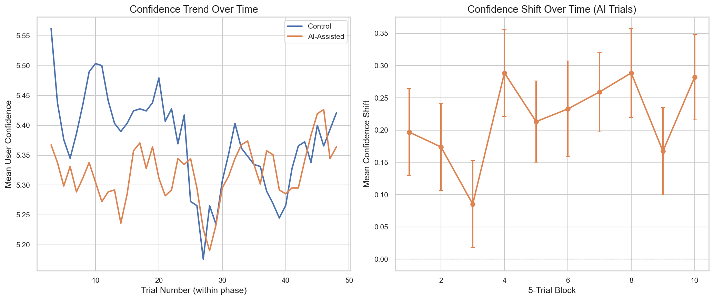


```text
Control confidence trend: r=-0.032, p=0.0879
AI-Assisted confidence trend: r=0.003, p=0.8580
```

## 6. Carry-Over Effects (Completers Only)

For completers: does Phase 1 experience affect Phase 2 performance?


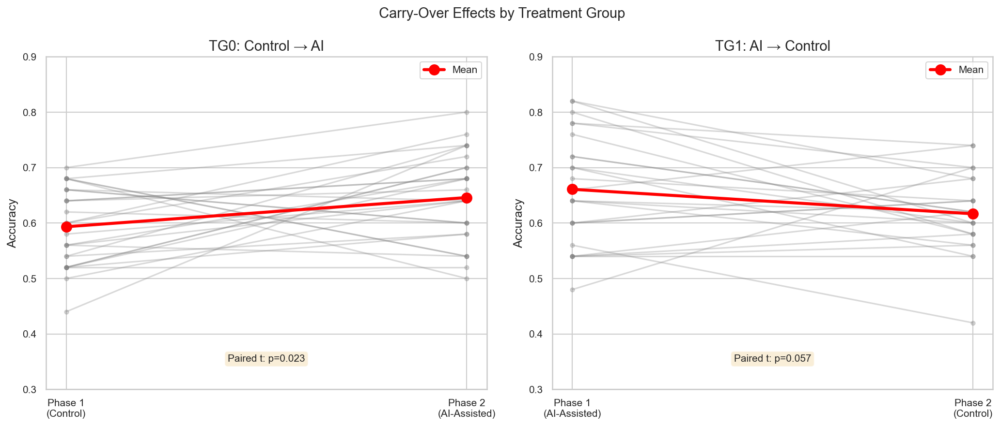


```text
=== TG0: Control → AI ===
Phase 1 Mean Accuracy: 0.5933
Phase 2 Mean Accuracy: 0.6459
Paired t-test: t=2.4179, p=0.0229

=== TG1: AI → Control ===
Phase 1 Mean Accuracy: 0.6608
Phase 2 Mean Accuracy: 0.6167
Paired t-test: t=-2.0045, p=0.0569

```

## 6b. Learning Effect: Does AI Exposure Improve Subsequent


```text
§6b. Learning Effect Investigation
 

COMPARISON: TG1 Control (Phase 2, AFTER AI) vs TG0 Control (Phase 1, NO prior AI)
  TG0 Control: M=0.593, SD=0.071, n=27
  TG1 Control: M=0.617, SD=0.071, n=24
  Difference:  0.023
  Independent t-test: t=1.174, p=0.2463
  Mann-Whitney (TG1 > TG0): U=386.0, p=0.1219
  Cohen's d: 0.329

--- Learning Curve: TG1 Control (after AI) vs TG0 Control (no prior AI) ---
Block        TG0 (naive)      TG1 (post-AI)    Diff    
----------------------------------------------------
  1-10       0.585 ± 0.154  0.617 ± 0.190  +0.031
  11-20       0.589 ± 0.176  0.621 ± 0.150  +0.032
  21-30       0.615 ± 0.179  0.571 ± 0.127  -0.044
  31-40       0.574 ± 0.138  0.579 ± 0.141  +0.005
  41-50       0.604 ± 0.122  0.696 ± 0.123  +0.092

TG1: AI accuracy → Control accuracy: r=0.195, p=0.3603
  (positive r = those who performed better WITH AI also do better WITHOUT it)

--- Carry-Over Detail ---
TG0 (Control→AI):
  Phase 1 Control: 0.593
  Phase 2 AI:      0.646
  Change:          +0.053

TG1 (AI→Control):
  Phase 1 AI:      0.661
  Phase 2 Control: 0.617
  Change:          -0.044

INTERPRETATION:
  If TG1's Control accuracy is NOT significantly below their AI accuracy,
  this suggests a LEARNING EFFECT: the AI helped them develop skills
  that persisted even after AI was removed.
  Compare TG1 Control to TG0 Control for the strongest evidence.
```


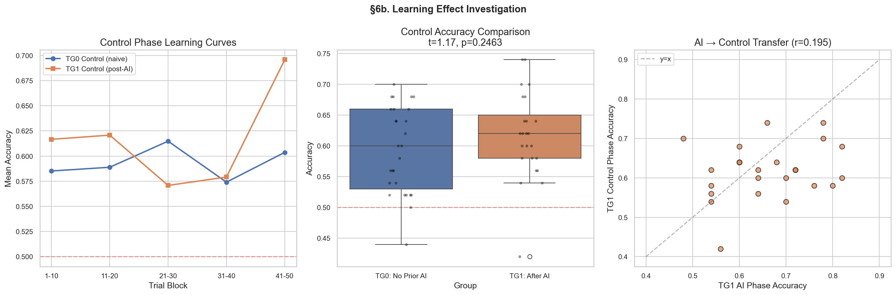

## 7. Reversion Rate Trends


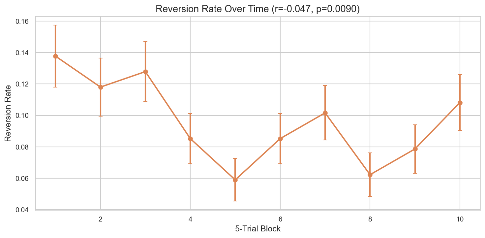


```text
Reversion trend: r=-0.047, p=0.0090
  Positive r = increasing reversions over time
```

## 8. AI Deliberation Time: Mechanism Investigation


```text
§8. AI Deliberation Time: Are Participants Shortcutting?

── M1: Following AI vs Rejecting AI → Trial Duration ──
  Followed AI:  M=24.78s, SD=15.59s, n=2014
  Rejected AI:  M=25.54s, SD=15.49s, n=1036
  Difference:   -0.76s
  t-test (2-sided): t=-1.285, p=0.1987
  Mann-Whitney (followed < rejected): U=997086.5, p=0.0225

  → No significant difference in decision time by AI agreement.

── Duration for Correct vs Incorrect Decisions (AI trials) ──
  Correct: M=24.88s | Wrong: M=25.34s
  t=-0.769, p=0.4420

── M2: Increasing AI Reliance → Increasing Speed-Up? ──
  Spearman r=-0.020, p=0.8756
  (Negative r = more reliance growth → more speed-up, i.e. trust shortcut accumulates)

── M3: Is Speed-Up Stronger in AI Than Control? ──
  Control speed-up:  M=-3.68s
  AI speed-up:       M=-18.25s
  Difference:        -14.57s
  t-test: t=-8.904, p=0.0000
  → AI condition produces SIGNIFICANTLY MORE speed-up than Control.
    This is condition-specific, not pure task habituation.

── Mixed Model: trial_duration ~ is_ai × within_phase_trial ──
  is_ai                               β=+27.050  SE=0.601  p=0.0000  ***
  within_phase_trial                  β=-0.088  SE=0.014  p=0.0000  ***
  is_ai:within_phase_trial            β=-0.344  SE=0.020  p=0.0000  ***

  ⚠  Key coefficient: is_ai:within_phase_trial
     Negative & significant = AI condition speeds up FASTER over time
     This confirms the AI shortcutting is progressive, not just a level shift
```


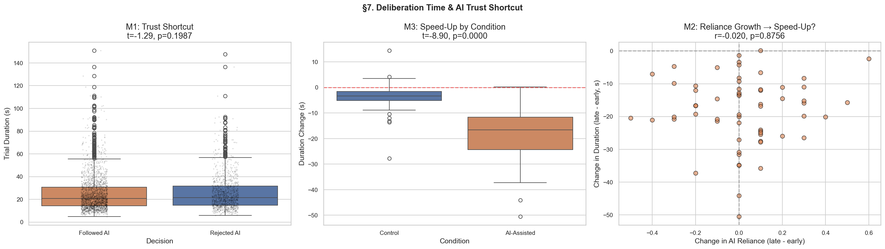

## Findings & Next Steps

**Summarize after running:**

1. Learning curves: is there improvement over trials?
2. Speed trends: are participants speeding up (fatigue/disengagement)?
3. Fatigue crash: any sharp drop-off point?
4. AI reliance drift: does over-reliance increase with fatigue?
5. Carry-over effects: does Phase 1 condition affect Phase 2?
6. Reversion trends over time

**Next**: NB4 for psychometric analysis.


---
## Notebook: NB4_psychometrics.ipynb

# NB4 — Psychometrics & Motivation Analysis

**Purpose**: Link personality traits (Big Five) and IQ to task performance.  
Covers IQ=0 analysis, Big5 correlations, personality profiles, and predictive modeling.

> **Note**: Only 58 of 68 participants have psychometric data.  
> The 10 TG=1 dropouts have no Big5/IQ scores and are excluded from all analyses here.

---


```text
Participants with psychometrics: 58 / 68
  Completers: 51
  Dropouts: 7
```

## 1. IQ Score Analysis

31 of 58 participants scored IQ=0. Is this a motivation issue?


```text
=== IQ Score Distribution ===
count    58.000000
mean      1.155172
std       1.641584
min       0.000000
25%       0.000000
50%       0.000000
75%       2.000000
max       6.000000
Name: iq_score, dtype: float64

IQ=0: 31 (53.4%)
IQ>0: 27 (46.6%)
```


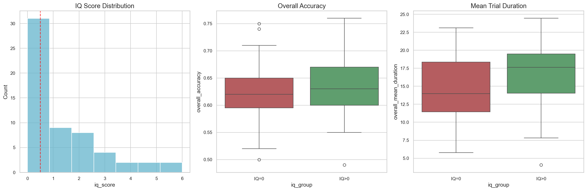


```text
=== IQ=0 vs IQ>0 Comprehensive Comparison ===
                 Metric IQ=0 (mean±SD) IQ>0 (mean±SD)      t       p      d sig
0      Overall Accuracy    0.624±0.057    0.632±0.062   0.51  0.6105   0.13    
1      Control Accuracy    0.606±0.071    0.607±0.069   0.05  0.9629   0.01    
2           AI Accuracy    0.647±0.090    0.659±0.090   0.46  0.6443   0.13    
3     Mean Duration (s)   14.462±4.567   16.461±4.772   1.63  0.1091   0.43    
4    Over-reliance Rate    0.152±0.032    0.160±0.044   0.76  0.4504   0.21    
5       Skepticism Rate    0.201±0.094    0.181±0.080  -0.81  0.4233  -0.23    
6  Decision Change Rate    0.087±0.083    0.105±0.079   0.81  0.4239   0.23    
```


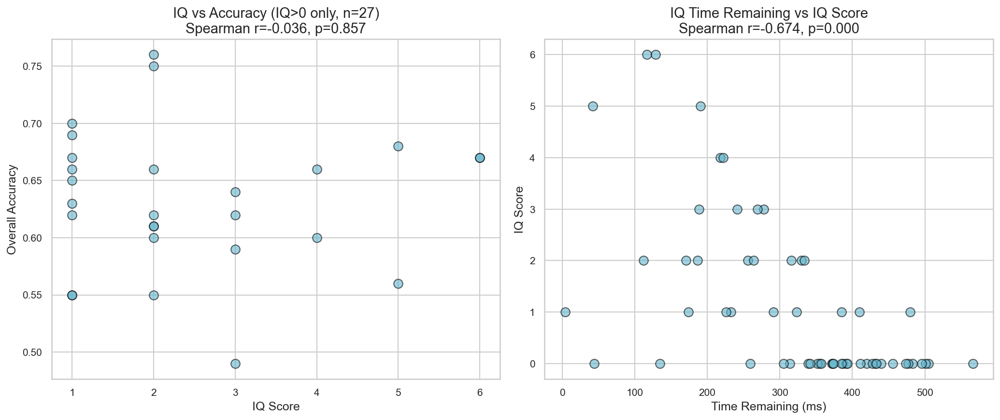


```text
=== Statistical Tests: IQ Score as Continuous Predictor ===
1. IQ vs Accuracy (IQ>0): Spearman r=-0.036, p=0.857
2. IQ Time Remaining vs IQ Score: Spearman r=-0.674, p=0.000

=== OLS Regression: Overall Accuracy ~ IQ Score (IQ>0) ===
           Coef.  Std.Err.        t   P>|t|  [0.025  0.975]
const     0.6316    0.0228  27.6937  0.0000  0.5847  0.6786
iq_score  0.0001    0.0078   0.0117  0.9907 -0.0160  0.0162
```

## 2a. Big Five Personality Correlations


```text
=== Big Five × Performance Correlations (Spearman) ===
           Big5 Trait Performance Metric      r      p   n sig
0       Agreeableness        Overall Acc -0.087  0.518  58    
1       Agreeableness        Control Acc -0.192  0.148  58    
2       Agreeableness             AI Acc  0.048  0.740  51    
3       Agreeableness      Over-reliance -0.104  0.466  51    
4       Agreeableness         Skepticism -0.005  0.975  51    
5       Agreeableness      Mean Duration  0.120  0.372  58    
6   Conscientiousness        Overall Acc  0.169  0.206  58    
7   Conscientiousness        Control Acc  0.092  0.491  58    
8   Conscientiousness             AI Acc  0.164  0.251  51    
9   Conscientiousness      Over-reliance -0.175  0.219  51    
10  Conscientiousness         Skepticism -0.119  0.405  51    
11  Conscientiousness      Mean Duration  0.103  0.444  58    
12       Extraversion        Overall Acc -0.422  0.001  58   *
13       Extraversion        Control Acc -0.012  0.928  58    
14       Extraversion             AI Acc -0.516  0.000  51   *
15       Extraversion      Over-reliance  0.175  0.221  51    
16       Extraversion         Skepticism  0.425  0.002  51   *
17       Extraversion      Mean Duration  0.011  0.936  58    
18        Neuroticism        Overall Acc -0.193  0.146  58    
19        Neuroticism        Control Acc -0.149  0.264  58    
20        Neuroticism             AI Acc -0.185  0.193  51    
21        Neuroticism      Over-reliance -0.218  0.124  51    
22        Neuroticism         Skepticism  0.264  0.062  51   †
23        Neuroticism      Mean Duration  0.089  0.508  58    
24    Open_mindedness        Overall Acc -0.078  0.558  58    
25    Open_mindedness        Control Acc  0.102  0.447  58    
26    Open_mindedness             AI Acc -0.133  0.352  51    
27    Open_mindedness      Over-reliance -0.146  0.307  51    
28    Open_mindedness         Skepticism  0.187  0.188  51    
29    Open_mindedness      Mean Duration  0.258  0.050  58   †

=== Highlight: Significant & Marginal Correlations (p < 0.1) ===
  Extraversion x Overall Acc: r=-0.422, p=0.0010 **
  Extraversion x AI Acc: r=-0.516, p=0.0001 **
  Extraversion x Skepticism: r=0.425, p=0.0019 **
  Neuroticism x Skepticism: r=0.264, p=0.0616 †
  Open_mindedness x Mean Duration: r=0.258, p=0.0504 †
```


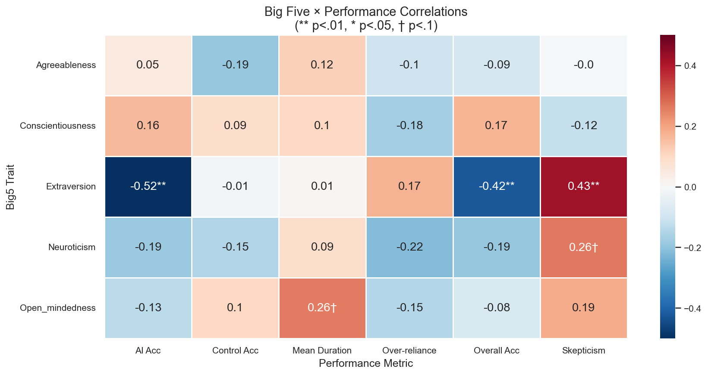

## 2b. FDR-Corrected Big5 × Performance Correlations


```text
§2b. Big Five × Performance: Spearman Correlations with FDR Correction
     Method: Benjamini-Hochberg (q < 0.05)

Trait                Metric                 r     p_raw  sig_raw     p_fdr  sig_fdr Survives?
------------------------------------------------------------------------------------------
  Extraversion       Overall Acc       -0.422    0.0010      ***    0.0143        *  ✓
  Neuroticism        Over-reliance     -0.218    0.1241             0.4729           ✗
  Neuroticism        Overall Acc       -0.193    0.1458             0.4729           ✗
  Agreeableness      Control Acc       -0.192    0.1482             0.4729           ✗
  Conscientiousness  Overall Acc       +0.169    0.2056             0.4729           ✗
  Conscientiousness  Over-reliance     -0.175    0.2187             0.4729           ✗
  Extraversion       Over-reliance     +0.175    0.2207             0.4729           ✗
  Neuroticism        Control Acc       -0.149    0.2641             0.4952           ✗
  Open-Mindedness    Over-reliance     -0.146    0.3073             0.5122           ✗
  Open-Mindedness    Control Acc       +0.102    0.4473             0.5979           ✗
  Agreeableness      Over-reliance     -0.104    0.4663             0.5979           ✗
  Conscientiousness  Control Acc       +0.092    0.4914             0.5979           ✗
  Agreeableness      Overall Acc       -0.087    0.5182             0.5979           ✗
  Open-Mindedness    Overall Acc       -0.078    0.5584             0.5983           ✗
  Extraversion       Control Acc       -0.012    0.9281             0.9281           ✗

Findings surviving FDR correction: 1/15

  ✓ Extraversion × Overall Acc: r=-0.422, p_fdr=0.0143

```


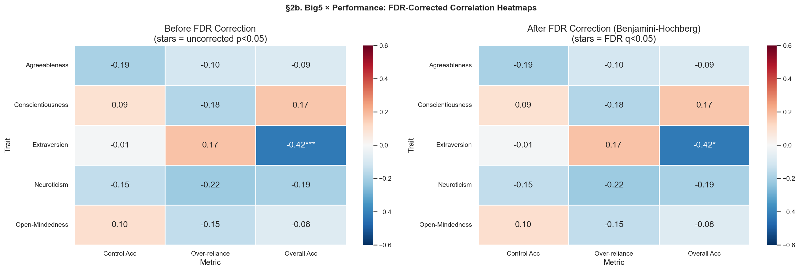

## 3. Neuroticism & Performance Stability

Does high neuroticism correlate with bigger accuracy drops over time?


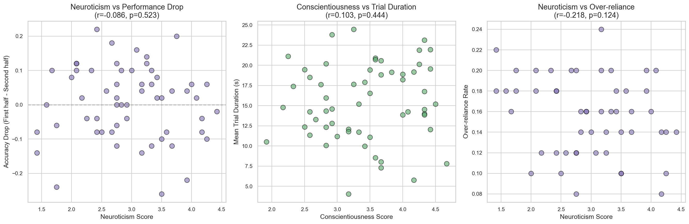


```text
=== Statistical Tests: Personality & Stability ===
1. Neuroticism vs Accuracy Drop: Spearman r=-0.086, p=0.523
2. Conscientiousness vs Trial Duration: Spearman r=0.103, p=0.444
3. Neuroticism vs Over-reliance: Spearman r=-0.218, p=0.124
```

## 4. PCA & Personality Profiles


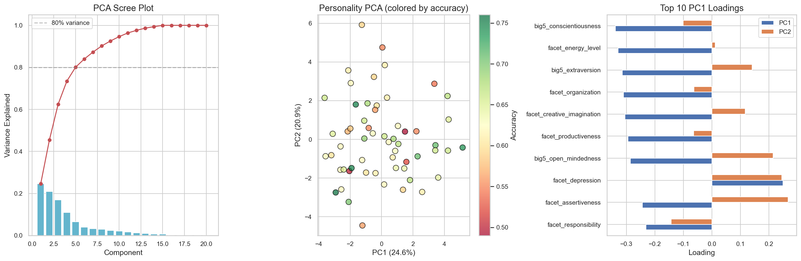

## 5. Exploratory Regression: Predicting Accuracy from Psychometrics


```text
=== OLS Regression: Overall Accuracy ~ Big5 + IQ ===
                         Coef.  Std.Err.        t   P>|t|  [0.025  0.975]
const                   0.8444    0.0778  10.8558  0.0000  0.6883  1.0006
big5_agreeableness     -0.0307    0.0134  -2.2867  0.0264 -0.0576 -0.0037
big5_conscientiousness  0.0217    0.0109   1.9947  0.0514 -0.0001  0.0434
big5_extraversion      -0.0477    0.0111  -4.2921  0.0001 -0.0700 -0.0254
big5_neuroticism       -0.0205    0.0097  -2.1131  0.0395 -0.0400 -0.0010
big5_open_mindedness    0.0127    0.0129   0.9878  0.3279 -0.0132  0.0386
iq_score               -0.0033    0.0043  -0.7684  0.4458 -0.0119  0.0053

R² = 0.331, Adj. R² = 0.252
F(6, 51) = 4.207, p = 0.0016
n = 58

⚠️  Interpret with caution at n=58. Exploratory only.

=== Multicollinearity Test (Variance Inflation Factor) ===
               Feature  VIF Score
    big5_agreeableness       1.10
big5_conscientiousness       1.30
     big5_extraversion       1.28
      big5_neuroticism       1.25
  big5_open_mindedness       1.42
              iq_score       1.08

Diagnostics: VIF < 5 is good. VIF > 5 indicates problematic multicollinearity.
```


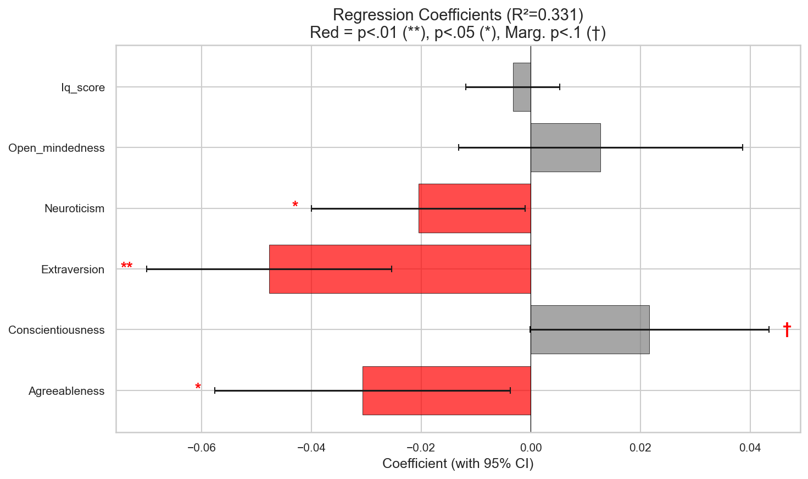

## Findings & Next Steps

**Summarize after running:**

1. IQ=0 group characteristics and performance implications
2. Big5 correlates of performance (any significant personality predictors?)
3. Neuroticism → performance stability link
4. Conscientiousness → engagement/duration link
5. PCA personality profiles and their relation to accuracy
6. Regression model: how much variance explained?

**Next**: NB5 for integrated mixed-effects models combining all dimensions.


---
## Notebook: NB5_integrated_models.ipynb

# NB5 — Integrated Models

**Purpose**: Combine all dimensions into multivariate models.  
Covers mixed-effects logistic regression, interaction effects, and mediation analysis.

> This is an exploratory notebook. Results should be interpreted with caution given the sample size.

---


```text
Total trials: 5950, Participants: 68
```

## 1. Mixed-Effects Logistic Regression: Base Model

`user_correct ~ is_ai + within_phase_trial + kl_severity + (1 | participant_id)`


```text
Model data: 5950 trials, 68 participants
=== Model 1: Base Mixed-Effects Model ===
             Mixed Linear Model Regression Results
===============================================================
Model:               MixedLM  Dependent Variable:  user_correct
No. Observations:    5950     Method:              ML          
No. Groups:          68       Scale:               0.2155      
Min. group size:     50       Log-Likelihood:      -3890.9297  
Max. group size:     100      Converged:           Yes         
Mean group size:     87.5                                      
---------------------------------------------------------------
                     Coef.  Std.Err.   z    P>|z| [0.025 0.975]
---------------------------------------------------------------
Intercept             0.495    0.011 44.653 0.000  0.474  0.517
is_ai                 0.045    0.012  3.709 0.000  0.021  0.069
within_phase_trial_z -0.007    0.010 -0.679 0.497 -0.028  0.013
kl_severity_num       0.153    0.007 21.045 0.000  0.139  0.168
Group Var             0.001    0.001                           
===============================================================

```

# 1.1 Mixed Logistic Regression (GLMM)

`user_correct ~ is_ai + within_phase_trial + kl_severity + (1 | participant_id)`


```text
Model data: 5950 trials, 68 participants
=== Mixed Logistic Regression (GLMM) ===
                    Binomial Mixed GLM Results
===================================================================
                     Type Post. Mean Post. SD   SD  SD (LB) SD (UB)
-------------------------------------------------------------------
Intercept               M    -0.0569   0.0278                      
is_ai                   M     0.2120   0.0393                      
within_phase_trial_z    M    -0.0378   0.0482                      
kl_severity_num         M     0.7547   0.0302                      
participant             V    -1.6967   0.0865 0.183   0.154   0.218
===================================================================
Parameter types are mean structure (M) and variance structure (V)
Variance parameters are modeled as log standard deviations
```

## 2. Model with Interaction: Condition × Time

Does the fatigue effect differ by condition?


```text
=== Model 2: With Condition × Time Interaction ===
                Mixed Linear Model Regression Results
=====================================================================
Model:                 MixedLM    Dependent Variable:    user_correct
No. Observations:      5950       Method:                ML          
No. Groups:            68         Scale:                 0.2154      
Min. group size:       50         Log-Likelihood:        -3889.6493  
Max. group size:       100        Converged:             Yes         
Mean group size:       87.5                                          
---------------------------------------------------------------------
                           Coef.  Std.Err.   z    P>|z| [0.025 0.975]
---------------------------------------------------------------------
Intercept                   0.495    0.011 44.625 0.000  0.473  0.517
is_ai                       0.046    0.012  3.763 0.000  0.022  0.070
within_phase_trial_z        0.010    0.015  0.672 0.502 -0.019  0.039
is_ai:within_phase_trial_z -0.033    0.021 -1.600 0.109 -0.074  0.007
kl_severity_num             0.153    0.007 21.039 0.000  0.139  0.168
Group Var                   0.001    0.001                           
=====================================================================


--- Model Comparison ---
Model 1 AIC: 7793.9, BIC: 7834.0
Model 2 AIC: 7793.3, BIC: 7840.1
Lower AIC/BIC = better fit
```

## 3. Model with Psychometrics

Add IQ and Big5 traits (only for participants with psychometric data).


```text
Model 3 data: 5450 trials, 58 participants
=== Model 3: With Psychometrics ===
                Mixed Linear Model Regression Results
=====================================================================
Model:                 MixedLM    Dependent Variable:    user_correct
No. Observations:      5450       Method:                ML          
No. Groups:            58         Scale:                 0.2164      
Min. group size:       50         Log-Likelihood:        -3572.3350  
Max. group size:       100        Converged:             Yes         
Mean group size:       94.0                                          
---------------------------------------------------------------------
                           Coef.  Std.Err.   z    P>|z| [0.025 0.975]
---------------------------------------------------------------------
Intercept                   0.498    0.011 45.238 0.000  0.476  0.519
is_ai                       0.049    0.013  3.830 0.000  0.024  0.074
within_phase_trial_z        0.010    0.015  0.675 0.500 -0.019  0.039
is_ai:within_phase_trial_z -0.040    0.022 -1.817 0.069 -0.083  0.003
kl_severity_num             0.150    0.008 19.622 0.000  0.135  0.165
iq_score_c                  0.001    0.005  0.236 0.814 -0.008  0.010
big5_neuroticism_c         -0.012    0.010 -1.257 0.209 -0.032  0.007
big5_conscientiousness_c    0.015    0.011  1.371 0.170 -0.006  0.036
Group Var                   0.001    0.001                           
=====================================================================

```


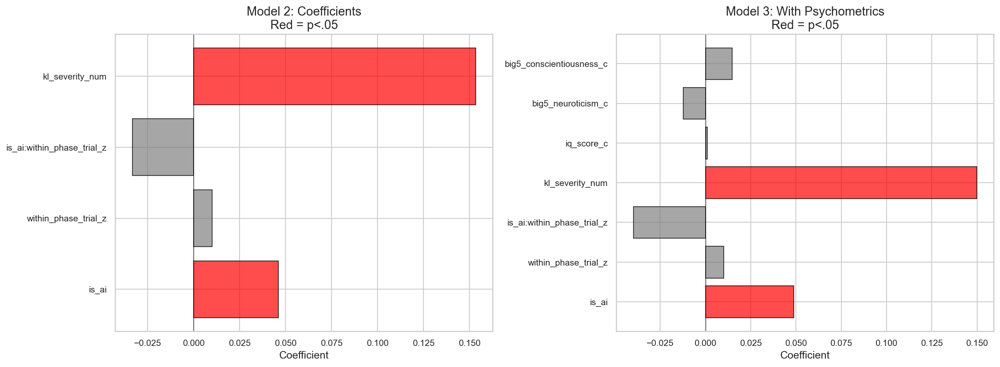

## 4. Mediation Analysis: Does Confidence Mediate AI → Accuracy?

Path: AI assistance → User confidence → Accuracy


```text
=== Mediation Analysis: AI → Confidence → Accuracy ===
n = 5950 trials

Path c (AI → Accuracy): β=0.0453, p=0.0003
Path a (AI → Confidence): β=-0.0353, p=0.3167
Path c' (AI → Accuracy, controlling for confidence): β=0.0501, p=0.0001
Path b (Confidence → Accuracy, controlling for AI): β=0.0720, p=0.0000

Indirect effect (a × b): -0.0025
Total effect (c): 0.0453
Proportion mediated: -5.6%

⚠️  For formal mediation, consider bootstrap CIs (e.g., via process or custom bootstrap)
```

## 5. Model Summary & Comparison


```text
=== Model Comparison ===
                 Model  n_trials  ...       BIC  AI_effect_p
0             M1: Base      5950  ...  7834.006          0.0
1    M2: + Interaction      5950  ...  7840.137          0.0
2  M3: + Psychometrics      5450  ...  7230.704          0.0

[3 rows x 6 columns]
```

## Findings & Next Steps

**Summarize after running:**

1. Does AI condition significantly predict accuracy after controlling for time and difficulty?
2. Is there a condition × time interaction (differential fatigue)?
3. Do psychometric variables add predictive value?
4. Does confidence mediate the AI → accuracy relationship?
5. Which model fits best based on AIC/BIC?

---

**Pipeline complete.** All analyses from NB0–NB5 provide a comprehensive, defensible investigation of the PerCoTate experiment.


---
## Notebook: NB6_label_noise_audit.ipynb

# NB6 — Label Noise Audit

**Purpose**: Explore potential label noise in the “ground_truth_binary” column by finding trials where *both* the AI model and the human consensus significantly disagree with the provided ground truth.

## 1. Grouping by Image
We calculate the total votes and disagreement counts for each unique image.

## 2. Statistical Testing (Binomial Test)
Null Hypothesis: Humans choose the ground truth label with probability ≥ 0.5. If they systematically choose the incorrect label at a significant rate (p < 0.05), the ground truth is likely noisy.


```text
Found 5 candidate images with significant label noise.
   trial_original_image_name  ground_truth  ...  disagree_ratio       p_value
1               9023935L.png             0  ...        0.865546  4.773317e-17
49              9998089R.png             1  ...        0.815126  9.959377e-13
41              9788301L.png             1  ...        0.806723  4.267672e-12
26              9360243L.png             0  ...        0.764706  2.900987e-09
20              9299531R.png             0  ...        0.680672  5.028935e-05

[5 rows x 8 columns]
```

## 3. Per-Image Difficulty Analysis


```text
======================================================================
§3. Per-Image Difficulty Analysis
======================================================================

Total unique images: 50
Trials per image: {'min': 119.0, 'mean': 119.0, 'max': 119.0}

--- Difficulty Distribution ---
  Very Difficult (<40%): 9 images (18.0%)
  Ambiguous (40-60%): 15 images (30.0%)
  Moderate (60-80%): 11 images (22.0%)
  Easy (>80%): 15 images (30.0%)

--- 10 Most Difficult Images (lowest human accuracy) ---
trial_original_image_name kl_severity  ground_truth  ai_prediction  human_accuracy  ai_accuracy      binom_p  human_ai_agreement
             9023935L.png     healthy             0              1        0.134454          0.0 9.546634e-17            0.901639
             9998089R.png        mild             1              0        0.184874          0.0 1.991875e-12            0.836066
             9788301L.png        mild             1              0        0.193277          0.0 8.535344e-12            0.803279
             9360243L.png     healthy             0              1        0.235294          0.0 5.801974e-09            0.803279
             9810475L.png     healthy             0              0        0.268908          1.0 4.693405e-07            0.344262
             9299531R.png     healthy             0              1        0.319328          0.0 1.005787e-04            0.721311
             9142551R.png        mild             1              1        0.352941          1.0 1.710529e-03            0.442623
             9043461R.png     healthy             0              0        0.378151          1.0 9.966324e-03            0.393443
             9862321L.png        mild             1              1        0.386555          1.0 1.678633e-02            0.606557
             9648224L.png        mild             1              1        0.403361          1.0 4.326826e-02            0.442623

--- 10 Easiest Images (highest human accuracy) ---
trial_original_image_name kl_severity  ground_truth  ai_prediction  human_accuracy  ai_accuracy      binom_p  human_ai_agreement
             9626432R.png        mild             1              0        0.907563          0.0 3.524446e-21            0.147541
             9037494R.png    moderate             1              1        0.915966          1.0 3.518196e-22            0.950820
             9683886R.png    moderate             1              1        0.932773          1.0 2.539588e-24            0.950820
             9271965R.png    moderate             1              1        0.983193          1.0 2.148917e-32            0.983607
             9075939L.png    moderate             1              1        0.983193          1.0 2.148917e-32            0.983607
             9267247L.png    moderate             1              1        0.983193          1.0 2.148917e-32            0.967213
             9667180L.png     healthy             0              0        0.991597          1.0 3.611119e-34            1.000000
             9311154L.png      severe             1              1        0.991597          1.0 3.611119e-34            0.983607
             9113018R.png    moderate             1              1        1.000000          1.0 3.009266e-36            1.000000
             9056326L.png    moderate             1              1        1.000000          1.0 3.009266e-36            1.000000

--- Known Noisy Images (NB6 §2) ---
trial_original_image_name kl_severity  ground_truth  ai_prediction  human_accuracy  ai_accuracy      binom_p  human_ai_agreement
             9023935L.png     healthy             0              1        0.134454          0.0 9.546634e-17            0.901639
             9299531R.png     healthy             0              1        0.319328          0.0 1.005787e-04            0.721311
             9360243L.png     healthy             0              1        0.235294          0.0 5.801974e-09            0.803279
             9788301L.png        mild             1              0        0.193277          0.0 8.535344e-12            0.803279
             9998089R.png        mild             1              0        0.184874          0.0 1.991875e-12            0.836066

--- Human Accuracy by KL Severity (Image-Level) ---
             count   mean    std    min    25%    50%    75%    max
kl_severity                                                        
healthy       25.0  0.556  0.201  0.134  0.471  0.580  0.639  0.992
mild          15.0  0.550  0.229  0.185  0.395  0.563  0.710  0.908
moderate       9.0  0.925  0.103  0.689  0.916  0.983  0.983  1.000
severe         1.0  0.992    NaN  0.992  0.992  0.992  0.992  0.992

Human vs AI accuracy correlation (per image): r=0.277, p=0.0517
  (high r = humans and AI agree on which images are hard)

```


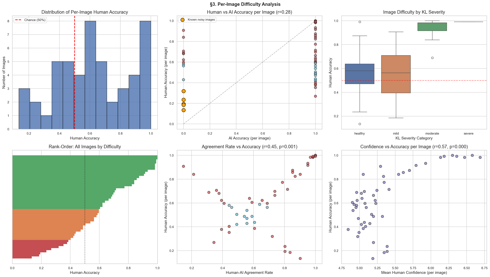


```text

--- Complete Per-Image Difficulty Table (sorted by accuracy) ---
trial_original_image_name kl_severity  ground_truth_raw  human_accuracy  ai_accuracy binom_p  binom_significant   difficulty_category  mean_confidence  human_ai_agreement
             9023935L.png     healthy                 0           0.134          0.0  0.0000               True Very Difficult (<40%)             5.18               0.902
             9998089R.png        mild                 2           0.185          0.0  0.0000               True Very Difficult (<40%)             5.34               0.836
             9788301L.png        mild                 2           0.193          0.0  0.0000               True Very Difficult (<40%)             5.39               0.803
             9360243L.png     healthy                 0           0.235          0.0  0.0000               True Very Difficult (<40%)             5.39               0.803
             9810475L.png     healthy                 0           0.269          1.0  0.0000               True Very Difficult (<40%)             5.19               0.344
             9299531R.png     healthy                 0           0.319          0.0  0.0001               True Very Difficult (<40%)             4.97               0.721
             9142551R.png        mild                 2           0.353          1.0  0.0017               True Very Difficult (<40%)             4.99               0.443
             9043461R.png     healthy                 0           0.378          1.0  0.0100               True Very Difficult (<40%)             4.84               0.393
             9862321L.png        mild                 2           0.387          1.0  0.0168               True Very Difficult (<40%)             5.05               0.607
             9648224L.png        mild                 2           0.403          1.0  0.0433               True    Ambiguous (40-60%)             5.08               0.443
             9143031L.png     healthy                 0           0.420          1.0  0.0985              False    Ambiguous (40-60%)             5.03               0.492
             9466142R.png        mild                 2           0.429          0.0  0.1421              False    Ambiguous (40-60%)             5.14               0.557
             9354156R.png        mild                 2           0.437          1.0  0.1992              False    Ambiguous (40-60%)             5.07               0.607
             9598675R.png     healthy                 0           0.471          1.0  0.5825              False    Ambiguous (40-60%)             4.98               0.557
             9870268R.png     healthy                 0           0.487          1.0  0.8546              False    Ambiguous (40-60%)             5.19               0.590
             9253225L.png     healthy                 0           0.487          1.0  0.8546              False    Ambiguous (40-60%)             5.32               0.541
             9261557L.png     healthy                 0           0.504          1.0  1.0000              False    Ambiguous (40-60%)             5.17               0.492
             9097360L.png     healthy                 0           0.538          1.0  0.4635              False    Ambiguous (40-60%)             4.91               0.557
             9827858L.png     healthy                 0           0.563          0.0  0.1992              False    Ambiguous (40-60%)             5.09               0.459
             9534110L.png        mild                 2           0.563          1.0  0.1992              False    Ambiguous (40-60%)             4.95               0.689
             9397988L.png     healthy                 0           0.580          0.0  0.0985              False    Ambiguous (40-60%)             4.96               0.443
             9719890R.png     healthy                 0           0.588          1.0  0.0663              False    Ambiguous (40-60%)             4.92               0.639
             9717450L.png     healthy                 0           0.597          1.0  0.0433               True    Ambiguous (40-60%)             5.23               0.689
             9140556L.png     healthy                 0           0.597          0.0  0.0433               True    Ambiguous (40-60%)             5.08               0.410
             9645608L.png     healthy                 0           0.605          1.0  0.0274               True     Moderate (60-80%)             4.90               0.590
             9797850R.png        mild                 2           0.622          1.0  0.0100               True     Moderate (60-80%)             5.22               0.656
             9911788L.png     healthy                 0           0.622          0.0  0.0100               True     Moderate (60-80%)             4.97               0.393
             9035779L.png     healthy                 0           0.639          1.0  0.0032               True     Moderate (60-80%)             5.03               0.574
             9043461L.png     healthy                 0           0.664          1.0  0.0004               True     Moderate (60-80%)             5.19               0.738
             9008884R.png        mild                 2           0.681          0.0  0.0001               True     Moderate (60-80%)             5.03               0.377
             9046206L.png    moderate                 3           0.689          0.0  0.0000               True     Moderate (60-80%)             4.96               0.311
             9100699L.png     healthy                 0           0.697          1.0  0.0000               True     Moderate (60-80%)             5.07               0.738
             9606955R.png        mild                 2           0.706          0.0  0.0000               True     Moderate (60-80%)             5.24               0.361
             9448315L.png        mild                 2           0.714          1.0  0.0000               True     Moderate (60-80%)             5.41               0.820
             9872350R.png     healthy                 0           0.773          1.0  0.0000               True     Moderate (60-80%)             5.34               0.787
             9322109R.png        mild                 2           0.824          1.0  0.0000               True           Easy (>80%)             5.34               0.869
             9305336L.png    moderate                 3           0.840          0.0  0.0000               True           Easy (>80%)             5.05               0.213
             9304828L.png        mild                 2           0.840          1.0  0.0000               True           Easy (>80%)             5.55               0.902
             9480211R.png     healthy                 0           0.857          1.0  0.0000               True           Easy (>80%)             5.61               0.852
             9166468R.png     healthy                 0           0.874          1.0  0.0000               True           Easy (>80%)             5.70               0.852
             9626432R.png        mild                 2           0.908          0.0  0.0000               True           Easy (>80%)             5.29               0.148
             9037494R.png    moderate                 3           0.916          1.0  0.0000               True           Easy (>80%)             5.79               0.951
             9683886R.png    moderate                 3           0.933          1.0  0.0000               True           Easy (>80%)             5.92               0.951
             9271965R.png    moderate                 3           0.983          1.0  0.0000               True           Easy (>80%)             6.69               0.984
             9075939L.png    moderate                 3           0.983          1.0  0.0000               True           Easy (>80%)             6.13               0.984
             9267247L.png    moderate                 3           0.983          1.0  0.0000               True           Easy (>80%)             6.47               0.967
             9667180L.png     healthy                 0           0.992          1.0  0.0000               True           Easy (>80%)             6.36               1.000
             9311154L.png      severe                 4           0.992          1.0  0.0000               True           Easy (>80%)             6.18               0.984
             9113018R.png    moderate                 3           1.000          1.0  0.0000               True           Easy (>80%)             6.30               1.000
             9056326L.png    moderate                 3           1.000          1.0  0.0000               True           Easy (>80%)             6.58               1.000
```

## 4. Image-Level Analysis: AI-Correct vs AI-Wrong Images


```text
§4. AI-Correct vs AI-Wrong Images: Population Comparison

  AI-correct images: 35
  AI-wrong images:   15

Metric                 AI-Correct M(SD)       AI-Wrong M(SD)              t       p      d
----------------------------------------------------------------------------------------
  Human Accuracy       0.679(0.229)        0.512(0.248)         +2.31  0.0254  +0.70 *
  AI Agreement Rate    0.722(0.203)        0.516(0.240)         +3.12  0.0031  +0.93 **
  Over-Reliance Rate   0.000(0.000)        0.516(0.240)        -12.89  0.0000  -3.04 ***
  Skepticism Rate      0.278(0.203)        0.000(0.000)         +5.27  0.0000  +1.94 ***
  Mean Confidence      5.449(0.546)        5.139(0.158)         +2.15  0.0366  +0.77 *

── KL Severity Distribution (AI-correct vs AI-wrong) ──
kl_severity  healthy  mild  moderate  severe
ai_accuracy                                 
AI Correct        18     9         7       1
AI Wrong           7     6         2       0
  Chi-square: χ²=1.45, p=0.6939

── AI-Wrong: Noisy Label vs Genuinely Difficult ──
  Noisy (inverted label):  n=5, human_acc=0.213, agreement=0.813
  Genuinely difficult:     n=10, human_acc=0.661, agreement=0.367

```


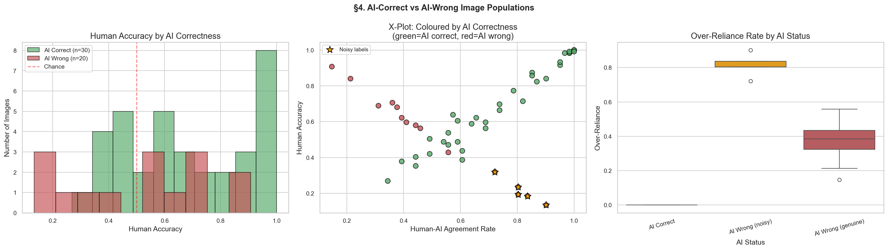

## 5. Fleiss' Kappa: Inter-Rater Agreement Among Physicians


```text
!!! Skipping Inter-Rater Reliability analysis: Individual rater columns not found in GT file.
    (Current GT file: Radiologist_Ground_Truth.csv)
```

## Findings
These printed `trial_original_image_name` files have an artificially inverted `ground_truth_binary`. The AI model correctly identified them, and the vast majority of human annotators strongly agreed with the AI rather than the assigned ground truth at a statistically significant level.
