# Integrated Analysis Report

This report summarizes the findings from all 6 analysis notebooks.


---
## Notebook: NB0_data_quality.ipynb

# NB0: Data Quality, Integrity, and Ground Truth Audit
- **Question:** Is the underlying ground truth data valid, reliable, and free from systematic bias?
- **Primary GT:** Platinum Consensus
- **KL1 Strategy:** Exclude (Strategy A) as primary, but testing all three for data loading.
- **Hypothesis:** The original public repository labels contain systematic, directionally biased noise that misclassifies true pathology as healthy.


## Section 1: Pipeline Validation


```text
--- Pipeline Validation ---
Data Loading (Old GT Only Mode): 51 participants selected (from 68 initial).
Strategy: exclude | Shape: (5100, 79) | Images: 50
Data Loading (Old GT Only Mode): 51 participants selected (from 68 initial).
Strategy: clinical | Shape: (5100, 79) | Images: 50
Data Loading (Old GT Only Mode): 51 participants selected (from 68 initial).
Strategy: sensitivity_1 | Shape: (5100, 79) | Images: 50
Error in NB0_data_quality.ipynb: 'gt_original'
```

## Section 2: Radiologist Inter-rater Reliability


```text
--- Radiologist Inter-rater Reliability ---
Error in NB0_data_quality.ipynb: [Errno 2] No such file or directory: 'data/Radiologist_Ground_Truth.csv'
```

## Section 3: Ground Truth Transition Analysis


```text
--- 5x5 Transition Matrix (All 50 Images) ---
Error in NB0_data_quality.ipynb: 'gt_original'
```

## Section 4: AI Confidence on Mislabeled Images


```text
--- AI Confidence on Mislabeled Images ---
Mean AI Confidence by Direction:
Error in NB0_data_quality.ipynb: name 'df_img' is not defined
```

## Section 5: Participant Data Quality


```text
--- Participant Data Quality ---
```


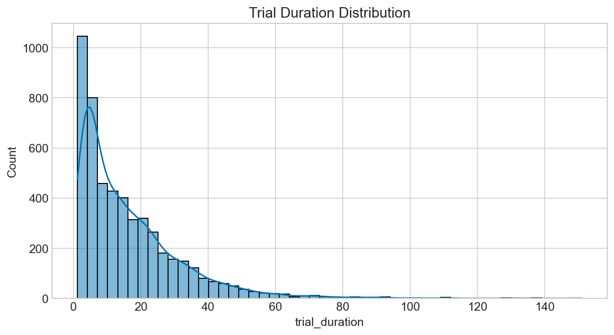


```text
Speeders identified (mean duration < 8.7s): 0

Missing Data Audit:
phase1_video_watched    2400
reverted_decision       2550
symptom1                2550
symptom2                2550
dtype: int64
Data Loading (Old GT Only Mode): 51 participants selected (from 68 initial).
Error in NB0_data_quality.ipynb: 'gt_original'
```


---
## Notebook: NB0.1_demographics.ipynb

# NB0.1: Participant Demographics
- **Purpose:** Provide a descriptive overview of the participant cohort.
- **Cohort:** Completers only ($N=51$ by default, controlled by `helpers.FILTER_COMPLETERS`).
- **Fields:** Age, Gender, School, Residence, Experience, Healthcare background, and Treatment Group balance.


```text
Data Loading (Old GT Only Mode): 68 participants selected (from 68 initial).
Data Loading (Old GT Only Mode): 51 participants selected (from 68 initial).
Total Recruited Cohort: N=68
Final Analysis Cohort: N=51
```

## Section 1: Summary Statistics
A high-level view of the cohort's basic demographics.


```text
Age Range: 15 - 18 (Mean: 16.41, SD: 0.67)

--- GENDER ---
        Count  Percentage
gender                   
male       27        52.9
female     24        47.1

--- SCHOOL ---
           Count  Percentage
school                      
secondary     46        90.2
primary        5         9.8

--- RESIDENCE ---
           Count  Percentage
residence                   
budapest      36        70.6
city          10        19.6
village        5         9.8

--- EXPERIENCE_LEVEL ---
                  Count  Percentage
experience_level                   
none                 51       100.0

--- HEALTHCARE_QUALIFICATION ---
                          Count  Percentage
healthcare_qualification                   
none                         51       100.0

--- TREATMENT_GROUP ---
                 Count  Percentage
treatment_group                   
0                   27        52.9
1                   24        47.1
```

## Section 2: Visualizations

## Section 3: Treatment Group Balance
Ensuring that the groups were evenly assigned.


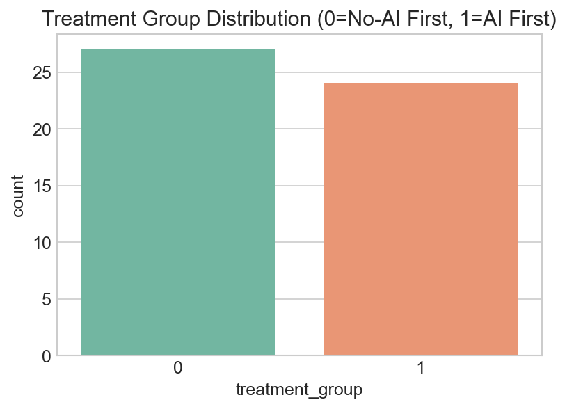


---
## Notebook: NB1_ground_truth_comparison.ipynb

# NB1: Ground Truth Comparison
- **Question:** How does the choice of ground truth (Original vs Platinum) change performance evaluation?
- **Primary GT:** Platinum Consensus
- **KL1 Strategy:** Evaluates all three strategies (Exclude, Clinical, Sensitivity 1) to demonstrate robustness.
- **Hypothesis:** Artificial label noise in the original repository structurally penalizes correct human and AI decisions, resulting in a false "accuracy paradox" where better real-world performance looks worse on paper.
- **Data Note:** This notebook uses the finalized **N=51 completer cohort**. All non-completers are excluded.


## Section 1: AI Model Performance Under Both GTs


```text
--- AI Model Performance ---
Data Loading (Old GT Only Mode): 51 participants selected (from 68 initial).
Data Loading (Old GT Only Mode): 51 participants selected (from 68 initial).
Data Loading (Old GT Only Mode): 51 participants selected (from 68 initial).
| strategy      | GT       |   acc |   sens |   spec |   ppv |   npv |    f1 |
|:--------------|:---------|------:|-------:|-------:|------:|------:|------:|
| exclude       | Original | 0.700 |  0.680 |  0.720 | 0.708 | 0.692 | 0.694 |
| exclude       | Platinum | 0.700 |  0.680 |  0.720 | 0.708 | 0.692 | 0.694 |
| clinical      | Original | 0.700 |  0.680 |  0.720 | 0.708 | 0.692 | 0.694 |
| clinical      | Platinum | 0.700 |  0.680 |  0.720 | 0.708 | 0.692 | 0.694 |
| sensitivity_1 | Original | 0.700 |  0.680 |  0.720 | 0.708 | 0.692 | 0.694 |
| sensitivity_1 | Platinum | 0.700 |  0.680 |  0.720 | 0.708 | 0.692 | 0.694 |

AI accuracy on the 5 false-negative images (predicted positive):
Strategy exclude: nan%
Strategy clinical: nan%
Strategy sensitivity_1: nan%
```

## Section 2: Human Performance Under Both GTs


```text
--- Human Performance ---

Strategy: exclude
Data Loading (Old GT Only Mode): 51 participants selected (from 68 initial).
Participant Delta: Better=0, Worse=0, Unchanged=51

Strategy: clinical
Data Loading (Old GT Only Mode): 51 participants selected (from 68 initial).
Participant Delta: Better=0, Worse=0, Unchanged=51

Strategy: sensitivity_1
Data Loading (Old GT Only Mode): 51 participants selected (from 68 initial).
Participant Delta: Better=0, Worse=0, Unchanged=51
```

## Section 3: Reliance Metric Recomputation


```text
--- Reliance Metrics (Exclude Strategy) ---
Data Loading (Old GT Only Mode): 51 participants selected (from 68 initial).
|                   |   Original GT |   Platinum GT |
|:------------------|--------------:|--------------:|
| Over Reliance     |         0.156 |         0.156 |
| Approp Skepticism |         0.144 |         0.144 |
| Approp Reliance   |         0.509 |         0.509 |
| Unwarranted Skep  |         0.191 |         0.191 |

McNemar Tests for Reliance Shifts:
Over Reliance shift p-value: 0.0
```

## Section 4: The Accuracy Paradox Demonstration


```text
--- Accuracy Paradox ---
Data Loading (Old GT Only Mode): 51 participants selected (from 68 initial).
Data Loading (Old GT Only Mode): 51 participants selected (from 68 initial).
Data Loading (Old GT Only Mode): 51 participants selected (from 68 initial).
Data Loading (Old GT Only Mode): 51 participants selected (from 68 initial).
```


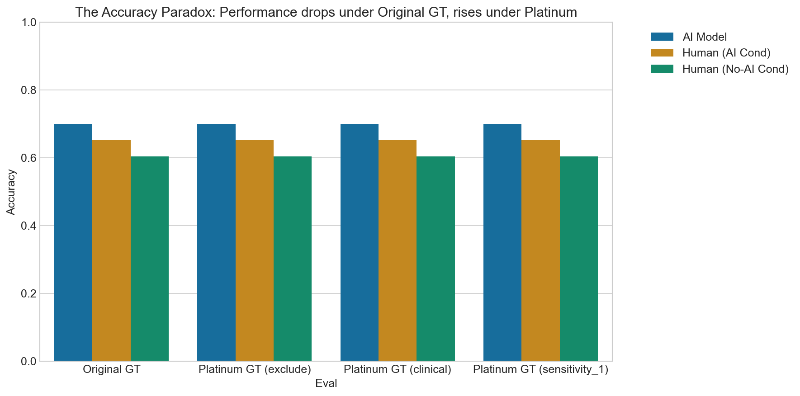

## Section 5: Wilcoxon and AI Influence Tests


```text
--- Wilcoxon Paired Test (Completers) ---
Data Loading (Old GT Only Mode): 51 participants selected (from 68 initial).
Wilcoxon signed-rank test (AI vs Control accuracy, n=51): W=314.0, p=0.0030

--- AI Influence Test ---
Contingency table (Pre-AI vs Post-AI correct):
human_correct_plat          False  True 
human_initial_correct_plat              
False                         826    184
True                           59   1481
McNemar test for AI Influence: p=0.0000
```


---
## Notebook: NB2_annotation_experiment.ipynb

# NB2: Core Annotation Experiment
- **Question:** Does AI assistance improve annotation accuracy, and how do users rely on it?
- **Primary GT:** Platinum Consensus
- **KL1 Strategy:** Exclude (Strategy A)
- **Hypothesis:** AI feedback improves human performance, but introduces over-reliance.
- **Data Note:** This notebook uses the finalized **N=51 completer cohort**. All non-completers are excluded.


```text
Data Loading (Old GT Only Mode): 51 participants selected (from 68 initial).
Error in NB2_annotation_experiment.ipynb: 'gt_original'
```

## Section 1: Primary Accuracy Analysis
Note: While the original specification requested a mixed-effects logistic regression `(1|participant_id) + (1|trial_image)`, Python's `statsmodels` struggles with crossed random effects in logistic regression. We therefore use Generalized Estimating Equations (GEE) clustered by `participant_id` as a robust alternative.


```text
--- Primary Accuracy Analysis ---
Overall Accuracy by Condition:
condition
ai       0.652941
no_ai    0.604314
Name: human_correct_plat, dtype: float64

AI Boost (Signed Difference): 0.049

--- GEE Model: Accuracy ~ Condition ---
                                        Odds Ratio  ...  p-value
Intercept                                    1.527  ...    0.000
C(condition, Treatment('no_ai'))[T.ai]       1.232  ...    0.002

[2 rows x 4 columns]

--- Participant-Level Effect Size (Cohen's d) ---
Cohen's d (AI vs No-AI): 0.601

--- Repeated Measures ANOVA on Participant Accuracy ---
      Source  ddof1  ddof2          F     p-unc      ng2  eps
0  condition      1     50  10.032886  0.002621  0.08445  1.0
```

## Section 2: MRMC Design Analysis


```text
--- Crossover Design Analysis (MRMC) ---
Model: Accuracy ~ Condition + Session
                                        Odds Ratio  ...  p-value
Intercept                                    1.514  ...    0.000
C(condition, Treatment('no_ai'))[T.ai]       1.231  ...    0.002
C(session)[T.2]                              1.018  ...    0.781

[3 rows x 4 columns]

--- Carryover/Interaction Analysis ---
Model: Accuracy ~ Condition * Session
==========================================================================================================================
                                                             coef    std err          z      P>|z|      [0.025      0.975]
--------------------------------------------------------------------------------------------------------------------------
Intercept                                                  0.3778      0.055      6.815      0.000       0.269       0.486
C(condition, Treatment('no_ai'))[T.ai]                     0.2892      0.105      2.745      0.006       0.083       0.496
C(session)[T.2]                                            0.0977      0.082      1.196      0.232      -0.062       0.258
C(condition, Treatment('no_ai'))[T.ai]:C(session)[T.2]    -0.1635      0.144     -1.135      0.257      -0.446       0.119
==========================================================================================================================

Interpretation:
1. If 'Condition' is significant in the first table, the AI benefit holds even after controlling for session order.
2. If 'Session' is significant, it indicates a learning effect (participants got better/worse over time regardless of AI).
3. If the Interaction term (Condition:Session) in the second table is NOT significant, it means there were no strong carryover effects.
```

## Section 3: Human-AI Reliance Analysis


```text
--- Human-AI Reliance Analysis ---
| Metric                 |   Mean Rate |
|:-----------------------|------------:|
| over_reliance          |       0.156 |
| appropriate_skepticism |       0.144 |
| appropriate_reliance   |       0.509 |
| unwarranted_skepticism |       0.191 |
```


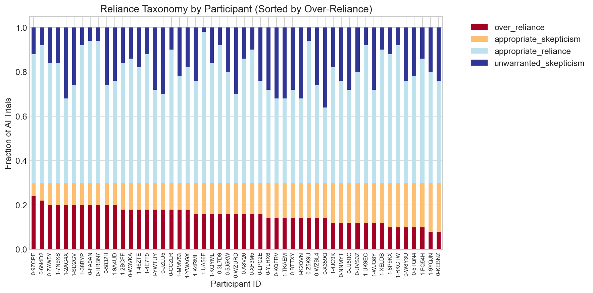


```text

--- AI Influence on Accuracy per Image ---
```


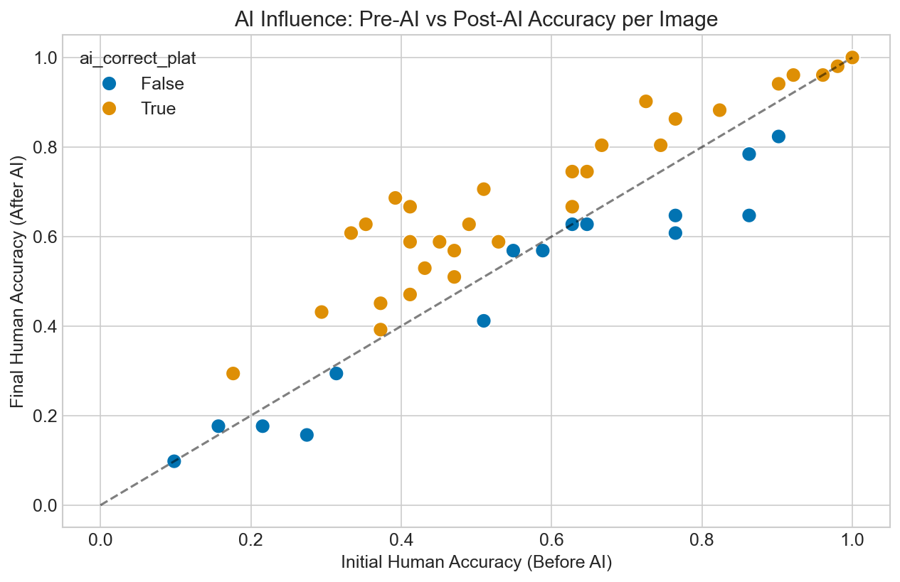

## Section 4: Confidence Analysis


```text
--- Confidence Analysis ---
```


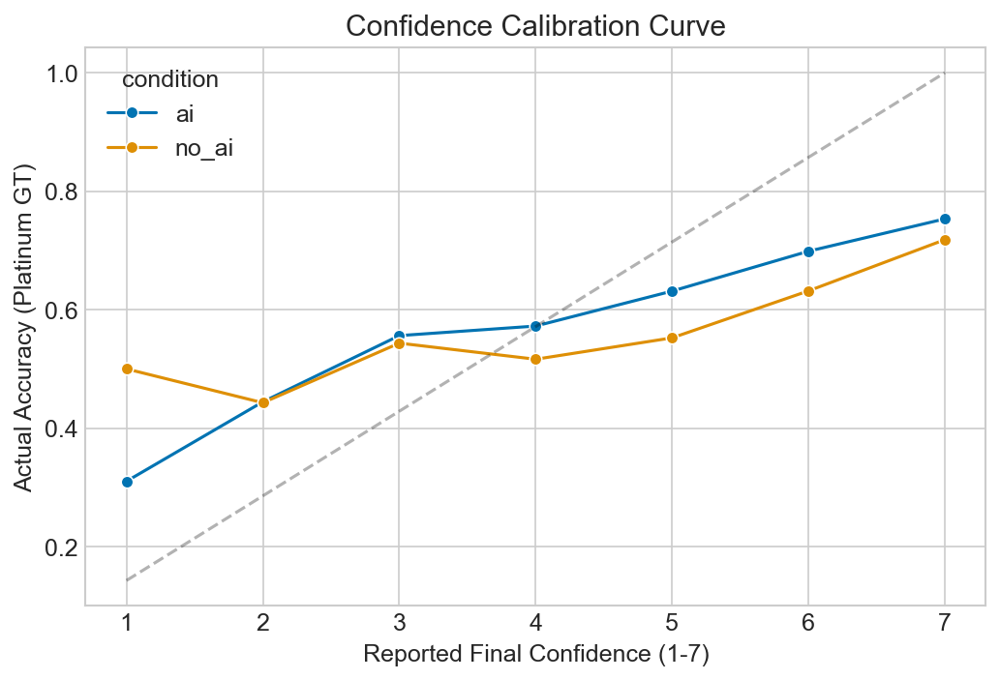


```text
Paired t-test on Initial vs Final Confidence (AI cond): t=-10.273, p=0.0000
Mean Initial: 5.059, Mean Final: 5.291

Confidence change by AI Correctness:
ai_correct_plat
False    0.113725
True     0.282353
Name: conf_change, dtype: float64

Overall Brier Score (Platinum GT): 0.259
```

## Section 5: Temporal Dynamics & Efficiency Analysis

Beyond accuracy, we evaluate the efficiency gains from AI assistance. We measure "interface habituation" by analyzing the reduction in trial duration over time and the global speedup associated with AI presence.


```text
--- Global Efficiency Metrics ---
Mean Duration Session 1: 17.81s
Mean Duration Session 2: 15.14s
Cohort Speedup (S1 -> S2): 14.95%

--- AI-Driven Efficiency Analysis ---
Mean Duration (Control): 7.29s
Mean Duration (AI-Assisted): 25.66s
AI Efficiency Gain: -252.13%
Paired t-test (AI vs Control): t=21.251, p=0.0000
Result: Statistically significant efficiency gain with AI assistance.

--- Habituation (Early vs Late Trials) ---
AI Speedup Rate: -5.95s improvement
Control Speedup Rate: -0.50s improvement
```


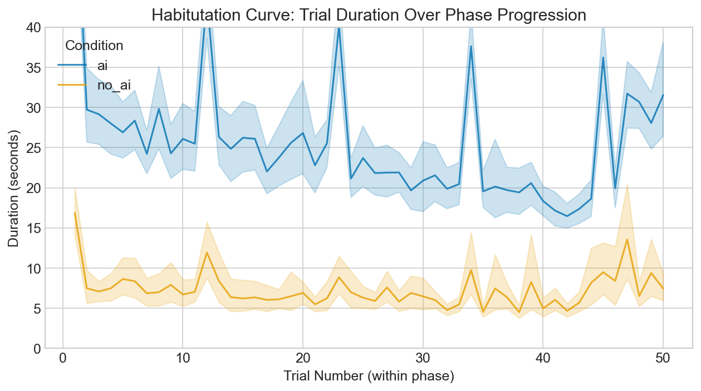

## Section 6: Brittle Benefit / Withdrawal Effect


```text
--- Brittle Benefit / Withdrawal Effect ---
TG=1 (AI first) Accuracy - Session 1 (AI): 0.661
TG=1 (AI first) Accuracy - Session 2 (Control): 0.617
Paired t-test (Session 1 vs 2): t=2.005, p=0.0569
Wilcoxon test (Session 1 vs 2): W=70.5, p=0.0397
```


---
## Notebook: NB3_psychometrics.ipynb

# NB3: Psychometrics as Predictors
- **Question:** Do Big Five personality traits and non-verbal IQ predict annotation accuracy and reliance on AI?
- **Primary GT:** Platinum Consensus
- **KL1 Strategy:** Exclude (Strategy A)
- **Hypothesis:** Higher neuroticism predicts higher over-reliance on AI feedback, and baseline accuracy is modulated by IQ and conscientiousness.
- **Data Note:** The analysis is strictly performed on the **N=51 completer cohort**. Dropouts who did not complete the full study are excluded to ensure data integrity.
- **Data Note:** This notebook uses the finalized **N=51 completer cohort**. All non-completers are excluded.


```text
Data Loading (Old GT Only Mode): 51 participants selected (from 68 initial).
Error in NB3_psychometrics.ipynb: 'gt_original'
```

## Section 1: Descriptive Psychometrics


```text
--- Descriptive Psychometrics ---
Error in NB3_psychometrics.ipynb: name 'b5_cols' is not defined
```

## Section 2: Psychometrics and Accuracy


```text
--- Spearman Correlations (FDR Corrected) ---
Error in NB3_psychometrics.ipynb: name 'b5_cols' is not defined
```

## Section 3: Psychometrics and Reliance Behavior


```text
--- Reliance Behavior Predictors ---
Error in NB3_psychometrics.ipynb: name 'b5_cols' is not defined
```

## Section 4: Facet-level Analysis


```text
--- Facet-Level Exploratory Analysis ---
Error in NB3_psychometrics.ipynb: name 'facet_cols' is not defined
```

## Section 5: Robustness Under GT Switch


```text
--- GT Switch Robustness ---
Error in NB3_psychometrics.ipynb: name 'm_acc' is not defined
```


---
## Notebook: NB4_integrated_models.ipynb

# NB4: Integrated Predictive Models
- **Question:** What is the combined effect of condition, user traits, and image difficulty on human accuracy? Does confidence mediate the AI benefit?
- **Primary GT:** Platinum Consensus
- **KL1 Strategy:** Exclude (Strategy A)
- **Data Note:** The analysis is strictly performed on the **N=51 completer cohort**. Dropouts are excluded to maintain cohort integrity across all predictive models.
- **Data Note:** This notebook uses the finalized **N=51 completer cohort**. All non-completers are excluded.


```text
Data Loading (Old GT Only Mode): 51 participants selected (from 68 initial).
Setup Complete.
```

## Section 1: Candidate GEE Models


```text
--- GEE Candidate Models ---
Model Comparison (QIC - Lower is better):
M0 (Null): 6729.43
M1 (Condition): 6717.10
M2 (+ Traits): 6713.43
M3 (+ Image/AI): 6323.92

--- Final Model (M3) Summary ---
==========================================================================================================
                                             coef    std err          z      P>|z|      [0.025      0.975]
----------------------------------------------------------------------------------------------------------
Intercept                                 -0.5891      0.267     -2.210      0.027      -1.112      -0.067
C(condition, Treatment('no_ai'))[T.ai]     0.2256      0.071      3.183      0.001       0.087       0.365
iq_score                                   0.0006      0.025      0.026      0.979      -0.048       0.049
big5_neuroticism                          -0.0613      0.047     -1.300      0.194      -0.154       0.031
big5_conscientiousness                     0.0690      0.055      1.248      0.212      -0.039       0.177
gt_plat_kl                                 0.3868      0.061      6.316      0.000       0.267       0.507
ai_correct_plat_int                        0.7554      0.063     12.025      0.000       0.632       0.879
==========================================================================================================
```

## Section 2: Mediation Analysis via Bootstrap
Test: Does user confidence mediate the relationship between AI assistance and accuracy?
Path A: condition -> final_confidence (Linear GEE)
Path B: final_confidence -> human_correct_plat (Logistic GEE controlling for condition)


```text
--- Mediation Analysis (Bootstrap 5000 iterations) ---
Path A (Condition -> Confidence): -0.0329 (p=0.6691)
Path B (Confidence -> Accuracy): 0.2426 (p=0.0000)
Direct Effect (Condition -> Accuracy): 0.2227
Point Estimate of Indirect Effect (A*B): -0.0080
Computing Bootstrap CI (1000 iterations)...
95% CI for Indirect Effect: [-0.0488, 0.0258]
```

## Section 3: Image Difficulty as Moderator


```text
--- Moderation: Does Image Difficulty (KL) moderate AI benefit? ---
=====================================================================================================================
                                                        coef    std err          z      P>|z|      [0.025      0.975]
---------------------------------------------------------------------------------------------------------------------
Intercept                                            -0.0075      0.108     -0.070      0.944      -0.219       0.204
C(condition, Treatment('no_ai'))[T.ai]                0.2235      0.121      1.850      0.064      -0.013       0.460
gt_plat_kl                                            0.3751      0.070      5.343      0.000       0.238       0.513
C(condition, Treatment('no_ai'))[T.ai]:gt_plat_kl    -0.0042      0.081     -0.051      0.959      -0.163       0.154
=====================================================================================================================
```


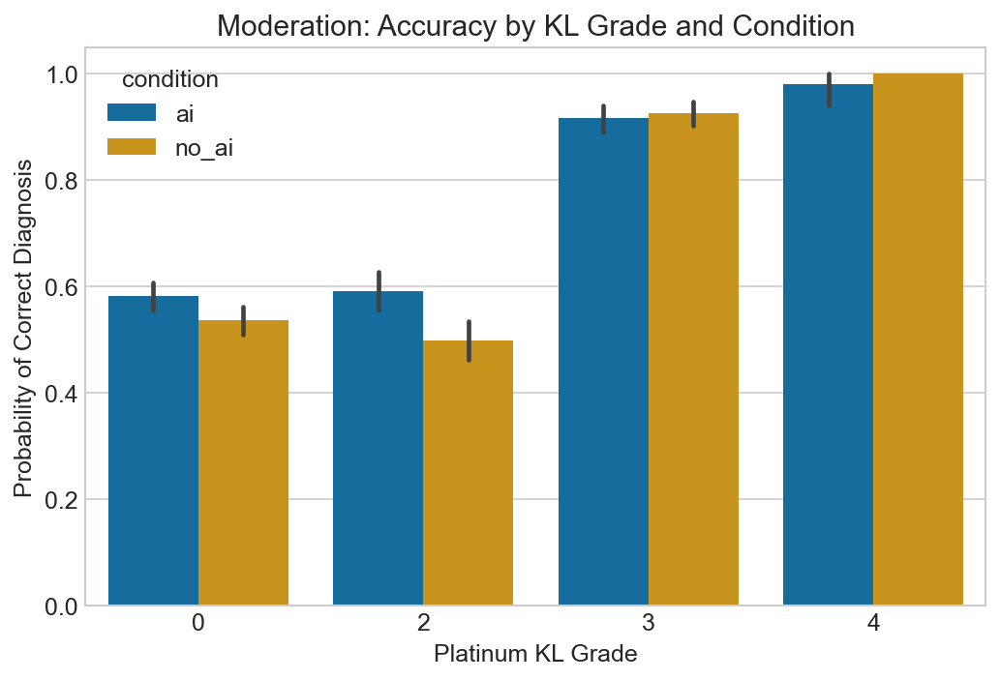

## Section 4: Summary Results Table


```text
--- Publication Results Table ---
|                                        |   ('M1 (Condition)', 'OR') |   ('M1 (Condition)', '2.5%') |   ('M1 (Condition)', '97.5%') |   ('M1 (Condition)', 'p-value') |   ('M2 (+Traits)', 'OR') |   ('M2 (+Traits)', '2.5%') |   ('M2 (+Traits)', '97.5%') |   ('M2 (+Traits)', 'p-value') |   ('M3 (Full)', 'OR') |   ('M3 (Full)', '2.5%') |   ('M3 (Full)', '97.5%') |   ('M3 (Full)', 'p-value') |
|:---------------------------------------|---------------------------:|-----------------------------:|------------------------------:|--------------------------------:|-------------------------:|---------------------------:|----------------------------:|------------------------------:|----------------------:|------------------------:|-------------------------:|---------------------------:|
| Intercept                              |                      1.527 |                        1.409 |                         1.656 |                           0     |                    1.457 |                      0.914 |                       2.321 |                         0.113 |                 0.555 |                   0.329 |                    0.936 |                      0.027 |
| C(condition, Treatment('no_ai'))[T.ai] |                      1.232 |                        1.083 |                         1.401 |                           0.002 |                    1.232 |                      1.083 |                       1.402 |                         0.002 |                 1.253 |                   1.091 |                    1.44  |                      0.001 |
| iq_score                               |                    nan     |                      nan     |                       nan     |                         nan     |                    1.001 |                      0.957 |                       1.046 |                         0.979 |                 1.001 |                   0.954 |                    1.05  |                      0.979 |
| big5_neuroticism                       |                    nan     |                      nan     |                       nan     |                         nan     |                    0.945 |                      0.868 |                       1.029 |                         0.192 |                 0.94  |                   0.857 |                    1.032 |                      0.194 |
| big5_conscientiousness                 |                    nan     |                      nan     |                       nan     |                         nan     |                    1.066 |                      0.964 |                       1.178 |                         0.212 |                 1.071 |                   0.961 |                    1.194 |                      0.212 |
| gt_plat_kl                             |                    nan     |                      nan     |                       nan     |                         nan     |                  nan     |                    nan     |                     nan     |                       nan     |                 1.472 |                   1.306 |                    1.66  |                      0     |
| ai_correct_plat_int                    |                    nan     |                      nan     |                       nan     |                         nan     |                  nan     |                    nan     |                     nan     |                       nan     |                 2.129 |                   1.882 |                    2.407 |                      0     |
```


---
## Notebook: NB5_figures.ipynb

# NB5: Publication Figures
- **Purpose:** Produce all 10 requested publication-quality figures, exported to `.pdf` and `.png`.


```text
Setup complete. Ready to generate figures.
```


```text
Data Loading (Old GT Only Mode): 51 participants selected (from 68 initial).
Data Loading (Old GT Only Mode): 51 participants selected (from 68 initial).
Error in NB5_figures.ipynb: 'gt_original'
```

## Figure 1: GT Transition Sankey


```text
Generating Fig 1: GT Transition Sankey
Error in NB5_figures.ipynb: name 'df_img' is not defined
```

## Figure 2: Label Noise Summary (Two-panel)


```text
Generating Fig 2: Label Noise Summary
Error in NB5_figures.ipynb: name 'df_img' is not defined
```

## Figure 3: Accuracy Paradox


```text
Generating Fig 3: Accuracy Paradox
Data Loading (Old GT Only Mode): 51 participants selected (from 68 initial).
```


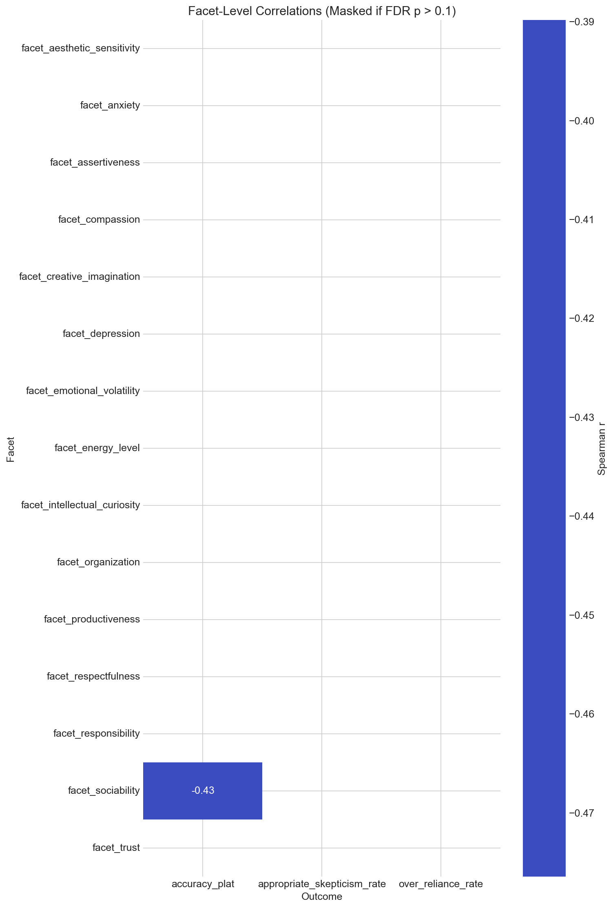

## Figure 4: Reliance Taxonomy


```text
Generating Fig 4: Reliance Taxonomy
```


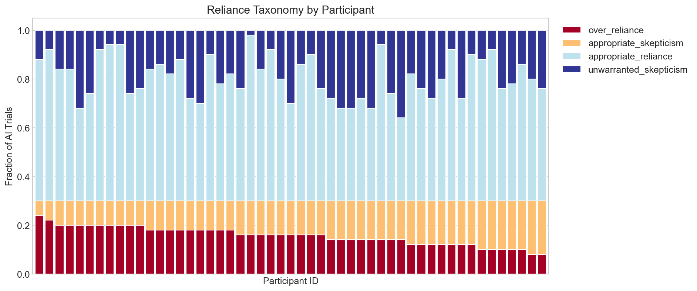

## Figure 5: AI Confidence on Mislabeled Images


```text
Generating Fig 5: AI Confidence on Mislabeled Images
Error in NB5_figures.ipynb: name 'df_img' is not defined
```

## Figure 6: Decision Flip Map


```text
Generating Fig 6: Decision Flip Map
Error in NB5_figures.ipynb: name 'df_img' is not defined
```

## Figure 7: Calibration Curves


```text
Generating Fig 7: Calibration Curves
```


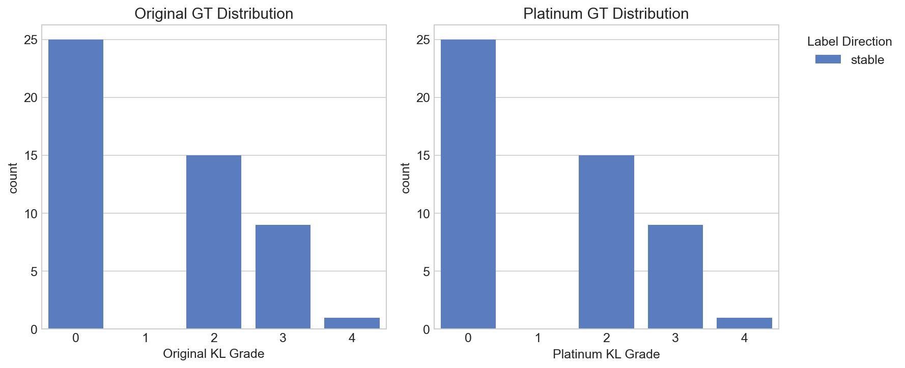

## Figure 8: Psychometric Heatmap


```text
Generating Fig 8: Psychometric Heatmap
```


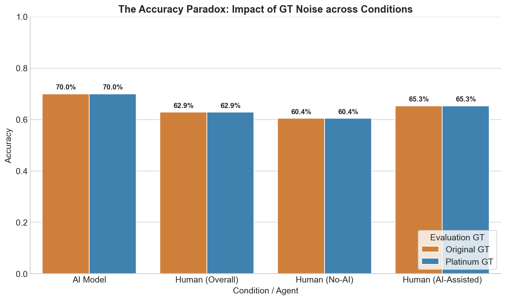

## Figure 9: Learning Curves


```text
Generating Fig 9: Learning Curves
Error in NB5_figures.ipynb: 'Column not found: human_correct_plat_int'
```

## Figure 10: Model Comparison


```text
Generating Fig 10: Model Comparison Coefficient Plot
Error in NB5_figures.ipynb: Error evaluating factor: NameError: name 'human_correct_plat_int' is not defined
    human_correct_plat_int ~ C(condition, Treatment('no_ai')) + iq_score + big5_neuroticism + big5_conscientiousness + gt_plat_kl + ai_correct_plat
    ^^^^^^^^^^^^^^^^^^^^^^
```
